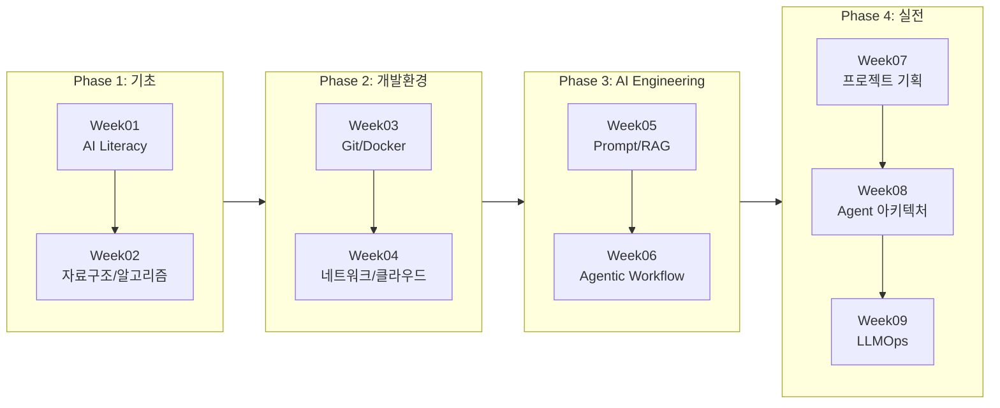

# 학습 로드맵

> [!overview] 과정 개요
> AI Literacy / LLM Product Engineering 교육 과정입니다.
> AI 기초부터 Agent 아키텍처, LLMOps까지 실무 중심으로 학습합니다.

## 커리큘럼 흐름도

## 주차별 인덱스

| 주차 | 주제 | 인덱스 |
|------|------|--------|
| Week 01 | AI Literacy | [[Week01-AI-Literacy]] |
| Week 02 | 자료구조와 알고리즘 | [[Week02-자료구조-알고리즘]] |
| Week 03 | 개발환경, Git, Docker | [[Week03-개발환경-Git-Docker]] |
| Week 04 | 네트워크와 클라우드 | [[Week04-네트워크-클라우드]] |
| Week 05 | Prompt Engineering & RAG | [[Week05-Prompt-Engineering-RAG]] |
| Week 06 | Agentic Workflow | [[Week06-Agentic-Workflow]] |
| Week 07 | AI 서비스 프로젝트 | [[Week07-프로젝트]] |
| Week 08 | Agent 아키텍처 | [[Week08-Agent-아키텍처]] |
| Week 09 | LLMOps / 배포 | [[Week09-LLMOps]] |

## 핵심 개념 허브

> [!tip] Graph View에서 아래 개념 노트들이 허브 역할을 합니다.

### Tier 1: Super Hubs
- [[RAG]] - RAG 기초~Agentic RAG
- [[LangGraph]] - 에이전트 프레임워크
- [[Prompt-Engineering]] - 프롬프팅 기법
- [[Agent-Architecture]] - 에이전트 설계 패턴
- [[FastAPI]] - 백엔드 프레임워크

### Tier 2: Major Hubs
- [[Git]] · [[Docker]] · [[Agentic-Workflow]] · [[Tool-Calling]] · [[MCP]] · [[LLM-보안]] · [[Supabase]]

## 대시보드
- [[전체-대시보드]]
- [[미션-대시보드]]

## 프로젝트
- [[ppt-workspace]] · [[solar-fastapi]] · [[lumi-agent-v02]] · [[lumi-agent-v06]] · [[lumi-agent-v07]] · [[버디핏-기획]]
