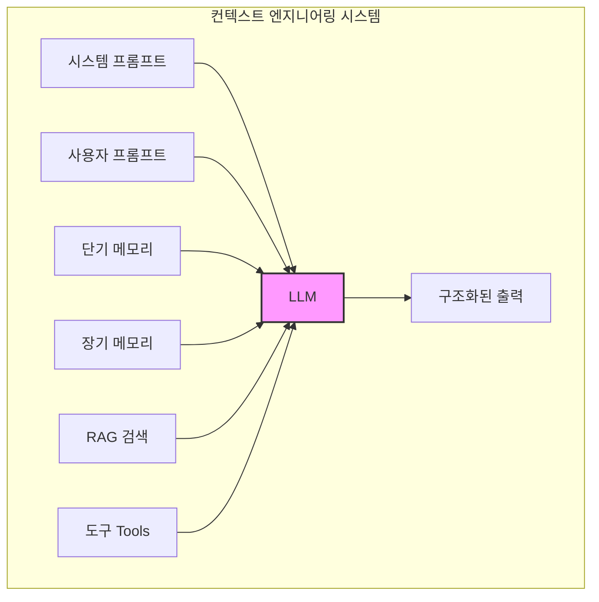

# AI 대화 설계 및 컨텍스트 엔지니어링

## 핵심 개념

> [!summary] 요약
> AI 모델(LLM)의 작동 원리(트랜스포머, 어텐션)를 이해하고, 이를 제어하는 기술인 프롬프트 엔지니어링과 컨텍스트 엔지니어링을 다룬다. 단순히 질문을 잘하는 것(Prompting)을 넘어, AI가 작동하는 전체적인 환경(시스템)을 설계하는 방법론을 제시한다.

## 주요 내용

### 1. 대규모 언어 모델(LLM)과 생성형 AI의 이해

- **[[LLM]]** (Large Language Model): 방대한 텍스트 데이터를 학습하여 다음에 올 단어를 확률적으로 예측하는 모델
  - 예: GPT, BERT, Solar 등
- **[[Transformer]] 알고리즘**: 기존 RNN/LSTM의 한계(순차 처리로 인한 속도 저하, 긴 문맥 망각)를 극복
  - 문장 전체를 한 번에 병렬 처리하여 **문맥(Context) 파악** 능력이 월등
- **Self-Attention 메커니즘**: 문장 내 단어 간의 관계(중요도)를 점수화하여 파악
  - 예: "피자를 먹었다"에서 '피자'와 '먹었다'의 연관성을 높게 계산

> [!key-concept] 생성형 AI 모델 종류
> | 모델 종류 | 작동 원리 비유 | 활용 분야 |
> |----------|-------------|----------|
> | GAN (적대적 신경망) | 위조지폐범 vs 경찰의 경쟁 학습 | 이미지 생성, 디자인 |
> | 확산 모델 (Diffusion) | 노이즈를 제거하며 원본을 복원하는 과정 학습 | Text-to-Image |
> | VAE (변분 오토인코더) | 그림의 '특징'만 압축했다가 다시 그려내는 방식 | 이미지 복원, 이상 탐지 |

**학습 단계 (GPT 기준)**
1. **사전 학습 (Pre-training)**: 세상의 지식과 언어 패턴 습득 (빈칸 채우기 등)
2. **파인 튜닝 (Fine-tuning)**: 특정 도메인(법률, 사주 등)에 맞게 미세 조정
3. **RLHF (인간 피드백 강화 학습)**: 사람이 원하는 윤리적/스타일에 맞는 답변을 하도록 교정

### 2. 프롬프트 엔지니어링 기초 및 핵심 요소

- **정의**: AI에게 효과적인 지시를 내려 최소한의 입력으로 최적의 결과물을 얻어내는 기술

**프롬프트 필수 3요소**
1. **지시 사항 (Instruction)**: 명확하고 간결한 명령 (예: "광고 문구를 작성해")
2. **맥락 (Context)**: AI가 '누구'이고 '왜' 이 작업을 하는지 배경 정보 제공
3. **출력 형식 (Output Format)**: 결과물의 형태 지정 (예: 표, JSON, 타임라인)

**보조 요소**
- **입력 데이터**: 요약/분석할 원문 제공
- **제약 조건**: "500자 이내", "전문 용어 제외" 등
- **예시 (Few-shot)**: 원하는 톤앤매너의 샘플 제공

### 3. 고급 프롬프팅 기법

- **Zero-shot**: 예시 없이 질문. 일반적인 상식에는 좋으나 최신/전문 정보에는 취약(환각 가능성)
- **One-shot / Few-shot**: 1개~3개의 예시를 제공. 일관성 있는 답변 유도에 탁월
- **CoT (Chain of Thought)**: "단계별로 생각해서 답해줘"라고 지시. 논리적 추론이나 수학 문제에 효과적
  - GPT의 경우 'Thinking Model'이 이미 이 과정을 내재화하고 있음
- **역할 할당 (Role Prompting)**: "당신은 20년 차 심리 상담가입니다." 특정 관점에 몰입시켜 답변의 깊이를 더함
- **메타 프롬프팅 (Meta Prompting)**: AI에게 "이 작업을 잘하기 위한 프롬프트를 네가 짜줘"라고 역으로 질문

**프롬프트 작성 요령**
- 싱글턴 방식: 단순 팩트 기반 즉문즉답
- 멀티턴 방식: 복잡한 주제에 대해 심층적으로 대화를 이어감
- 한 번에 한 가지 주제만 질문하여 깊이 있는 답변을 유도

### 4. 컨텍스트 엔지니어링 (Context Engineering)

- **개념**: 단순히 명령어(프롬프트) 하나를 잘 쓰는 것을 넘어, **AI가 작동하는 전체적인 환경(시스템)을 설계**하는 것
- 프롬프트 + 데이터베이스([[RAG]]) + 도구(Tools) + 메모리(Memory)를 하나의 패키지로 묶어 AI에게 제공

> [!tip] 프롬프트 vs 컨텍스트 엔지니어링
> | 구분 | 프롬프트 엔지니어링 | 컨텍스트 엔지니어링 |
> |------|---------------------|---------------------|
> | 초점 | 명령어 최적화 | 시스템 및 환경 설계 |
> | 입력 | 텍스트 질문 | 대화 기록, RAG, 도구, 사용자 성향 |
> | 목표 | "지금 무엇을 해야 하는가" | "무엇을 알고, 어떤 맥락에서 작동하는가" |

**컨텍스트 엔지니어링 7대 구성 요소**
1. **시스템 프롬프트**: 모델의 기본 역할과 규칙 정의 (변경 불변)
2. **사용자 프롬프트**: 사용자의 실제 질문
3. **단기 메모리**: 현재 대화 세션 내의 정보
4. **장기 메모리**: 사용자의 성향, 과거 기록
5. **[[RAG]] (검색 증강 생성)**: 외부 문서/최신 정보 참조
6. **도구 (Tools)**: 계산기, 웹 검색, API 호출 등
7. **구조화된 출력**: JSON, XML 등 시스템이 이해할 수 있는 포맷

## 흐름도

## 연결된 개념
- [[LLM]] - 대규모 언어 모델의 작동 원리
- [[Transformer]] - Self-Attention 기반 아키텍처
- [[프롬프트-엔지니어링]] - Zero-shot, Few-shot, CoT 등 기법
- [[컨텍스트-엔지니어링]] - AI 시스템 환경 설계
- [[RAG]] - 검색 증강 생성으로 환각 방지
