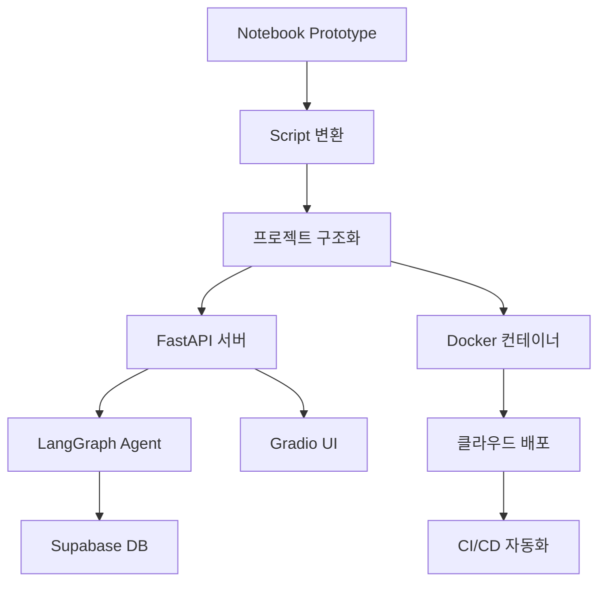

# Agent Architecture

## 핵심 개념

> [!summary] 요약
> 에이전트 시스템을 프로덕션 서비스로 배포하기 위한 아키텍처를 설계한다. 노트북 기반 프로토타입에서 실제 서비스로 전환하는 과정에서 필요한 스크립트 변환, 인프라 설정, 프론트엔드 구현, CI/CD 파이프라인 설계를 개괄한다.

## 주요 내용

### 1. 서비스 디플로이먼트 개요
- 노트북 → 스크립트 변환의 필요성
- 서비스 구성 요소: 백엔드, 프론트엔드, 인프라, CI/CD
- 현업 수준의 서비스 배포 프로세스
- 관련: [[Agent-Architecture]]

### 2. 에이전트 서비스 아키텍처
- FastAPI 기반 백엔드 구조
- LangGraph 그래프 설계 패턴
- 프로젝트 구조화:
  - `app/api/routes/` - HTTP 엔드포인트
  - `app/core/` - 설정, LLM, 프롬프트
  - `app/graph/` - LangGraph 노드/엣지
  - `app/repositories/` - DB 접근
- 관련: [[FastAPI]], [[LangGraph]]

### 3. idol-agent 프로젝트
- 버추얼 아이돌 AI 에이전트 서비스
- Solar LLM + Supabase(pgvector)
- RAG 기반 세계관 지식 검색
- 관련: [[Supabase]]

## 흐름도

## 연결된 개념
- [[Agent-Architecture]] - 에이전트 아키텍처 패턴
- [[FastAPI]] - FastAPI 프레임워크
- [[LangGraph]] - LangGraph
- [[Supabase]] - Supabase
