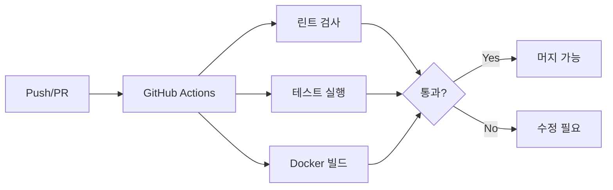

# GitHub Actions CI

## 핵심 개념

> [!summary] 요약
> GitHub Actions를 활용한 CI(Continuous Integration) 파이프라인을 구축한다. 코드 변경 시 자동으로 테스트, 린트, 빌드를 수행하는 워크플로우를 설계하고, 에이전트 프로젝트에 적합한 CI 전략을 학습한다.

## 주요 내용

### 1. CI 개념
- Continuous Integration의 목적과 가치
- CI 파이프라인 구성 요소: 린트, 테스트, 빌드
- CI를 통한 코드 품질 자동 관리
- 관련: [[CI-CD]]

### 2. GitHub Actions 기초
- Workflow, Job, Step 구조
- YAML 기반 워크플로우 정의
- 트리거 이벤트: push, pull_request
- 환경변수와 시크릿 관리

### 3. 에이전트 프로젝트 CI
- Python 프로젝트 CI 구성
- pytest 자동 실행
- Docker 이미지 빌드 자동화
- 코드 품질 검사 (ruff, mypy)
- 관련: [[Docker]]

## 흐름도

## 연결된 개념
- [[CI-CD]] - CI/CD 파이프라인
- [[Docker]] - Docker 컨테이너
- [[Git]] - Git 버전 관리
