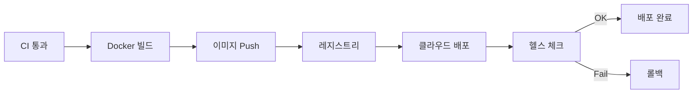

# CD (Continuous Deployment)

## 핵심 개념

> [!summary] 요약
> CI에 이어 CD(Continuous Deployment) 파이프라인을 구축하여 에이전트 서비스를 자동으로 배포한다. Docker 이미지 레지스트리 관리, 클라우드 배포 전략, 무중단 배포 기법을 학습한다.

## 주요 내용

### 1. CD 개념
- Continuous Delivery vs Continuous Deployment
- 배포 파이프라인 설계
- 배포 전략: Rolling, Blue-Green, Canary
- 관련: [[CI-CD]]

### 2. Docker 배포
- Docker 이미지 빌드 및 태깅
- 컨테이너 레지스트리 (GHCR, Docker Hub)
- docker-compose를 통한 멀티 컨테이너 관리
- 관련: [[Docker]]

### 3. 클라우드 배포
- 클라우드 환경에서의 에이전트 서비스 배포
- 환경변수 및 시크릿 관리
- 모니터링 및 로깅 설정
- 스케일링 전략

## 흐름도

## 연결된 개념
- [[CI-CD]] - CI/CD 파이프라인
- [[Docker]] - Docker 컨테이너화
- [[클라우드-컴퓨팅]] - 클라우드 인프라
