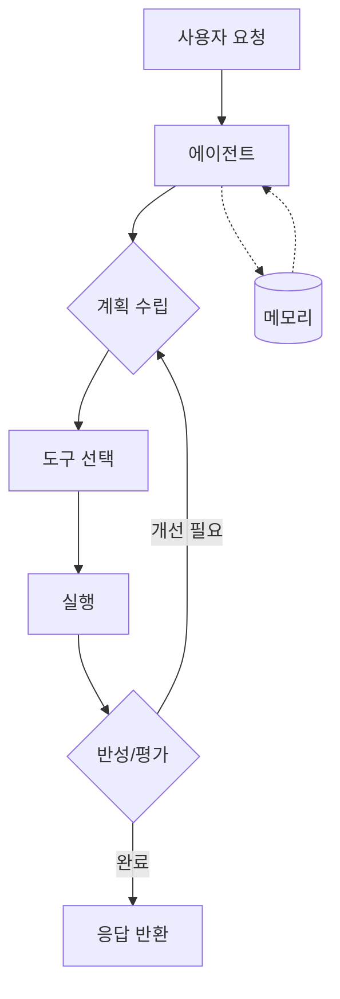

# AI 서비스와 에이전트 설계

## 핵심 개념

> [!summary] 요약
> AI 서비스 설계의 기본 원칙과 에이전트 아키텍처 패턴을 학습한다. Agentic AI의 핵심 구성요소(계획, 도구 사용, 메모리, 반성)를 이해하고, 워크플로우 기반 에이전트 설계 방법론을 다룬다.

## 주요 내용

### 1. AI 서비스 설계
- AI 서비스의 전체 아키텍처
- 사용자 요구사항에서 서비스 설계까지
- 프로덕션 환경에서의 고려사항
- 관련: [[AI 아키텍처]]

### 2. Agentic AI
- **에이전트**: 자율적으로 환경을 인식하고 행동하는 AI 시스템
- 핵심 구성요소:
  - **Planning**: 목표를 세우고 단계를 계획
  - **Tool Use**: 외부 도구를 활용하여 작업 수행
  - **Memory**: 과거 경험과 컨텍스트 유지
  - **Reflection**: 결과를 평가하고 개선
- 관련: [[Agentic AI]]

### 3. 에이전트 패턴
- **ReAct**: Reasoning + Acting의 결합
- **Plan-and-Execute**: 먼저 계획 수립 후 실행
- **Reflexion**: 결과 반성을 통한 자기 개선
- 관련: [[에이전트 패턴]]

### 4. Workflow와 Agent
- **워크플로우**: 미리 정의된 경로를 따르는 구조화된 실행
- **에이전트**: 상황에 따라 동적으로 경로를 결정
- 워크플로우와 에이전트의 하이브리드 접근
- 관련: [[Agentic Workflow]]

## 흐름도

## 연결된 개념
- [[AI 아키텍처]]
- [[Agentic AI]]
- [[에이전트 패턴]]
- [[Agentic Workflow]]
