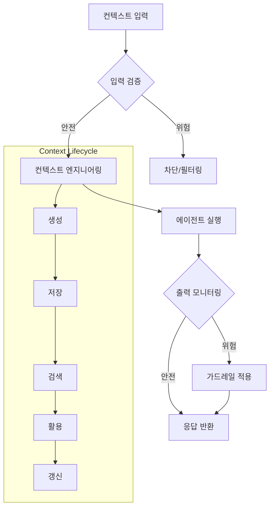

# Context Engineering & Safety

## 핵심 개념

> [!summary] 요약
> 에이전틱 워크플로우의 핵심인 Context Engineering 2.0 개념을 학습한다. 단순한 프롬프트 엔지니어링을 넘어 컨텍스트의 생애주기를 체계적으로 관리하는 방법론을 다루고, DeepAgent를 통한 성능 극대화 기법을 살펴본다. 또한 에이전트 시스템의 보안 취약점과 안전한 서비스 구축을 위한 가드레일 전략을 학습한다.

## 주요 내용

### 1. Context Engineering 2.0
- 프롬프트 엔지니어링에서 컨텍스트 엔지니어링으로의 진화
- 컨텍스트 생애주기 관리: 생성 → 저장 → 검색 → 활용 → 갱신
- 데이터 중심의 컨텍스트 최적화 전략
- 에이전트의 행동 품질은 컨텍스트 품질에 의존
- 관련: [[Context-Engineering]]

### 2. DeepAgent
- 에이전트 성능을 극대화하는 구축 기법
- 컨텍스트를 체계적으로 구조화하여 에이전트 잠재력 극대화
- 그동안 학습한 도구 사용, MCP, 메모리 관리의 통합 적용
- 관련: [[Agent-Architecture]]

### 3. Safety & Security
- 강력한 도구 사용 능력을 가진 에이전트의 내재적 위험
- 에이전트 시스템 보안 취약점:
  - **Prompt Injection**: 악의적 입력을 통한 에이전트 조작
  - **Tool Misuse**: 도구의 의도치 않은 사용
  - **Data Leakage**: 민감 정보 노출
- 관련: [[LLM-보안]]

### 4. 가드레일 전략
- 입력 검증 및 필터링
- 출력 모니터링 및 제한
- 도구 접근 권한 제어
- 안전한 컨텍스트 설계 패턴
- 관련: [[LLM-보안]]

## 실습/코드

- Practice07: Context Engineering 실습 ()
- Practice08: Safety Guardrails 실습 ()

## 흐름도

## 연결된 개념
- [[Context-Engineering]] - 컨텍스트 엔지니어링 핵심 개념
- [[LLM-보안]] - LLM 보안 및 안전성
- [[Agent-Architecture]] - 에이전트 아키텍처
- [[Prompt-Engineering]] - 프롬프트 엔지니어링 (이전 단계)
