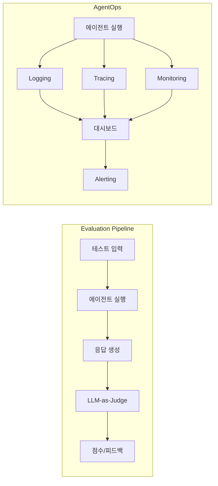

# Evaluation & AgentOps

## 핵심 개념

> [!summary] 요약
> 에이전트 시스템의 품질을 측정하고 평가하는 방법론과, 에이전트를 프로덕션 환경에서 운영·관리하는 AgentOps 전략을 학습한다. LLM 기반 시스템의 평가 지표 설계, 자동 평가 파이프라인, 그리고 모니터링·로깅·추적을 통한 에이전트 운영 방법을 다룬다.

## 주요 내용

### 1. LLM/에이전트 평가 (Evaluation)
- 기존 소프트웨어 테스트와 LLM 평가의 차이
- 평가 지표 설계: 정확성, 관련성, 안전성, 유용성
- LLM-as-Judge: LLM을 활용한 자동 평가
- Human Evaluation vs Automated Evaluation
- 관련: [[Agent-Evaluation]]

### 2. 평가 프레임워크
- 벤치마크 데이터셋 구축
- 평가 파이프라인 자동화
- A/B 테스트와 에이전트 성능 비교
- Regression Testing: 변경 시 성능 저하 감지
- 관련: [[Agent-Evaluation]]

### 3. AgentOps
- 에이전트 운영의 핵심 요소:
  - **Monitoring**: 실시간 성능 모니터링
  - **Logging**: 에이전트 행동 로깅
  - **Tracing**: 에이전트 실행 경로 추적
  - **Alerting**: 이상 탐지 및 알림
- 관련: [[AgentOps]]

### 4. 프로덕션 에이전트 관리
- 에이전트 버전 관리
- 비용 최적화 전략
- 에러 핸들링 및 복구 전략
- 스케일링 고려사항
- 관련: [[AgentOps]]

## 실습/코드

- Practice09: Evaluation 실습 ()
- Practice10: AgentOps 실습 ()

## 흐름도

## 연결된 개념
- [[Agent-Evaluation]] - 에이전트 평가 방법론
- [[AgentOps]] - 에이전트 운영 관리
- [[Agentic-Workflow]] - 에이전틱 워크플로우
- [[Agent-Architecture]] - 에이전트 아키텍처
