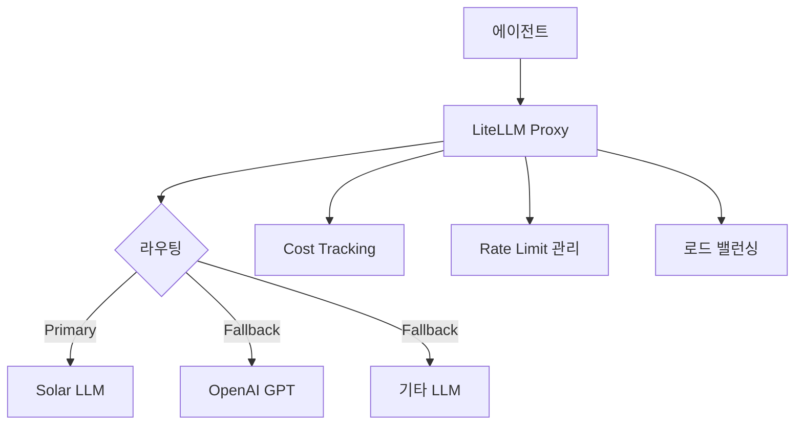

# API 이슈 & LiteLLM

## 핵심 개념

> [!summary] 요약
> LLM API 사용 시 발생하는 주요 이슈(Rate Limit, 비용, 가용성)를 다루고, LiteLLM을 활용한 멀티 LLM 프록시 솔루션을 학습한다. 여러 LLM 프로바이더를 통합 관리하여 Fallback, 로드 밸런싱, 비용 추적을 구현한다.

## 주요 내용

### 1. LLM API 이슈
- Rate Limit 관리와 대응 전략
- API 비용 최적화
- 프로바이더 가용성과 장애 대응
- 멀티 모델 전략의 필요성
- 관련: [[LLM]]

### 2. LiteLLM 소개
- LiteLLM: 통합 LLM API 프록시
- 100+ LLM 프로바이더 통합 인터페이스
- OpenAI 호환 API 형식
- 관련: [[LiteLLM]]

### 3. LiteLLM 핵심 기능
- **Fallback**: 프로바이더 장애 시 자동 전환
- **Load Balancing**: 여러 모델 간 부하 분산
- **Cost Tracking**: API 호출 비용 추적
- **Rate Limit Handling**: 자동 재시도 및 대기
- 관련: [[LiteLLM]]

### 4. idol-agent v0.6 통합
- LiteLLM을 통한 Solar LLM 프록시 설정
- Docker Compose에 LiteLLM 서비스 추가
- 환경별 설정 관리
- 관련: [[idol-agent-v06]], [[Docker]]

## 흐름도

## 연결된 개념
- [[LiteLLM]] - LiteLLM 프레임워크
- [[LLM]] - LLM 기초
- [[Docker]] - Docker 배포
- [[Agent-Architecture]] - 에이전트 아키텍처
