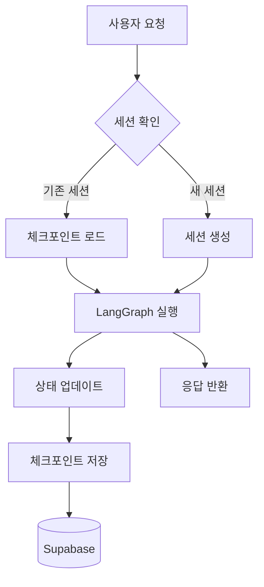

# 상태 관리

## 핵심 개념

> [!summary] 요약
> 에이전트 서비스의 상태 관리 패턴을 학습한다. LangGraph의 체크포인터를 활용한 대화 이력 관리, 세션 기반 상태 관리, 외부 저장소(Supabase)와의 상태 동기화 전략을 다룬다.

## 주요 내용

### 1. 에이전트 상태 관리의 필요성
- 대화 이력 유지
- 세션별 컨텍스트 분리
- 에이전트 실행 상태 추적
- 서비스 재시작 시 상태 복구
- 관련: [[상태관리]]

### 2. LangGraph 체크포인터
- MemorySaver: 인메모리 체크포인터
- PostgresSaver: Supabase 기반 영속 체크포인터
- 체크포인트 기반 대화 분기 및 되감기
- 관련: [[LangGraph]], [[Supabase]]

### 3. 세션 관리
- 사용자별 세션 식별
- 세션 생성, 조회, 삭제 API
- 세션 만료 정책
- 멀티 턴 대화 관리

### 4. idol-agent v0.7
- Supabase 기반 영속 체크포인터 적용
- 세션 관리 API 구현
- 대화 이력 조회 기능
- 관련: [[idol-agent-v07]]

## 흐름도

## 연결된 개념
- [[상태관리]] - 상태 관리 패턴
- [[LangGraph]] - LangGraph 체크포인터
- [[Supabase]] - Supabase 데이터베이스
- [[Memory-Management]] - 메모리 관리
