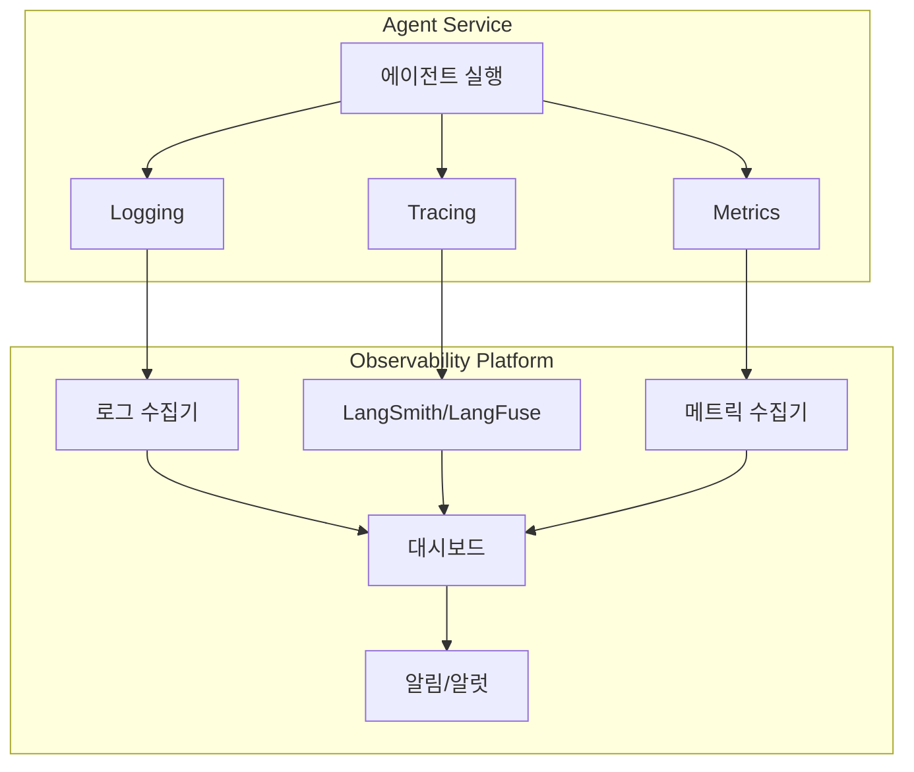

# Observability

## 핵심 개념

> [!summary] 요약
> 프로덕션 에이전트 서비스의 Observability(관측 가능성)를 구현한다. 로깅, 메트릭, 트레이싱의 세 가지 축을 통해 에이전트 시스템의 동작을 관찰하고, 문제를 진단하며, 성능을 최적화하는 방법을 학습한다.

## 주요 내용

### 1. Observability 개요
- Observability의 세 가지 축: Logs, Metrics, Traces
- 모니터링 vs Observability
- LLM 서비스 특화 관측 항목
- 관련: [[AgentOps]]

### 2. 로깅 (Logging)
- 구조화된 로깅 (JSON 포맷)
- 로그 레벨 전략
- LLM 호출 로깅: 입력/출력/토큰 수/지연 시간
- 로그 수집 및 중앙화

### 3. 트레이싱 (Tracing)
- 분산 트레이싱 개념
- LangSmith / LangFuse 활용
- 에이전트 실행 경로 추적
- 노드별 지연 시간 분석

### 4. 메트릭 (Metrics)
- 핵심 메트릭: 응답 시간, 토큰 사용량, 에러율
- 비용 메트릭 추적
- 사용자 만족도 지표
- 대시보드 구성

## 흐름도

## 연결된 개념
- [[AgentOps]] - 에이전트 운영 관리
- [[Agent-Evaluation]] - 에이전트 평가
- [[LangGraph]] - LangGraph 트레이싱
