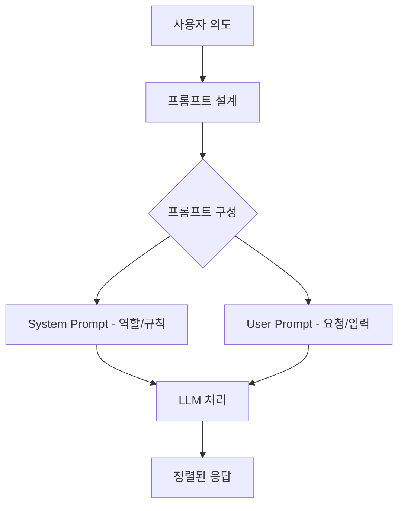

# Introduction & Basic Prompting

## 핵심 개념

> [!summary] 요약
> LLM은 대규모 텍스트 데이터를 학습하여 다음 단어를 예측하는 확률 기반 모델이다. 인간과 기계의 간극을 줄이기 위해 정렬(Alignment)이 필요하며, 프롬프트 엔지니어링은 모델이 사용자의 의도대로 출력하도록 유도하는 기법이다. 기본 프롬프팅에서는 Persona Injection과 In-context Learning을 다룬다.

## 주요 내용

### 1. Large Language Models
- LLM: 수많은 파라미터를 통해 방대한 텍스트를 학습하여 인간 언어 패턴을 이해/생성하는 모델
- 본질적으로 **다음에 올 단어를 맞히는 확률 기반 모델**
- ChatGPT, Solar LLM, LLaMA, Gemini, Claude, DeepSeek 등
- 관련: [[LLM]]

### 2. 기계와 사람의 간극
- 인간: 질문의 **의도와 맥락**을 파악하여 적절한 대응 선택
- LLM: 주어진 문맥에서 가장 **그럴듯한 다음 응답** 생성
- 개연성, 잘못된 정보, 표면적 요구 우선 처리 등 한계
- 관련: [[Alignment]]

### 3. 정렬(Alignment)
- 기계가 인간처럼 행동하도록 **간극을 줄이는 행위**
- AI 결과물이 인간의 기대치, 윤리적 기준, 의도와 일치하도록 방향 맞춤
- 사람 -> 모델 방향: **프롬프트 엔지니어링**으로 유도
- 모델 -> 사람 방향: 추가적인 학습을 통한 정렬
- 관련: [[Alignment]], [[프롬프트 엔지니어링]]

### 4. Basic Prompting
- 프롬프트 구성 요소:
  - **Role**: 모델의 관점과 정체성 정의 (System, User, Assistant)
  - **Instruction/Content**: 수행할 구체적 행동
- **시스템 프롬프트**: 최상위 레벨 명령어 집합, 고정된 컨텍스트
- **인풋 프롬프트**: 사용자가 직접 입력하는 가변적 요청
- 관련: [[프롬프트 구조]]

### 5. Persona Injection
- 모델에 특정 역할/성격을 부여하는 기법
- 관련: [[Persona Injection]]

### 6. In-context Learning
- 프롬프트 내 예시를 통해 모델이 패턴을 학습하도록 유도
- 관련: [[In-context Learning]]

## 흐름도

## 연결된 개념
- [[LLM]]
- [[Alignment]]
- [[프롬프트 엔지니어링]]
- [[Persona Injection]]
- [[In-context Learning]]
- [[프롬프트 구조]]
