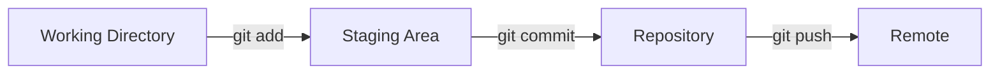
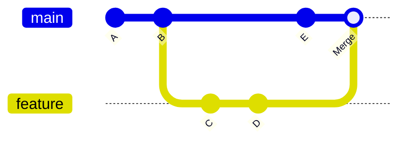

# Git 기본과 심화 - 버전 관리의 핵심

## 핵심 개념

> [!summary] 요약
> Git의 기본 개념(init/add/commit)부터 심화(branch/merge/rebase)까지 학습한다. 커밋이 작업의 핵심 단위이며, 브랜치를 활용한 병렬 개발과 머지/리베이스를 통한 통합 전략을 다룬다. Git 협업의 기초가 되는 원격 저장소와 push/pull 흐름도 포함한다.

## 주요 내용

### 1. Git 기본 -- 작업 단위 관리

**Git이란?**
- 분산 버전 관리 시스템 (DVCS)
- 코드 변경 이력을 추적하고, 여러 사람이 동시에 작업 가능

**핵심 명령어 3단계**

| 명령어 | 설명 |
|--------|------|
| `git init` | 현재 디렉토리에 Git 저장소 초기화 |
| `git add <파일>` | 변경 파일을 스테이징 영역에 추가 (추적 시작) |
| `git commit -m "메시지"` | 스테이징된 변경사항을 커밋으로 기록 |
| `git status` | 현재 작업 상태 확인 |
| `git log` | 커밋 이력 확인 |

> [!tip] 좋은 커밋 메시지 작성법
> - **무엇을** 변경했는지보다 **왜** 변경했는지를 기록
> - 한 커밋에 하나의 논리적 변경만 포함
> - 예: "사용자 인증 로직 추가" (O), "여러 파일 수정" (X)

### 2. Git 심화 -- 브랜치와 머지

**Branch (브랜치)**
- 독립적인 작업 흐름을 만드는 가지
- `main` 브랜치는 안정된 코드, `feature` 브랜치에서 새 기능 개발

| 명령어 | 설명 |
|--------|------|
| `git branch <이름>` | 새 브랜치 생성 |
| `git checkout <이름>` | 브랜치 전환 |
| `git checkout -b <이름>` | 생성과 동시에 전환 |

**Merge (머지)**
- 두 브랜치의 변경사항을 하나로 합침
- **Fast-forward**: 분기 없이 직선으로 합쳐지는 경우
- **3-way merge**: 분기점이 있는 경우, 공통 조상 기준으로 합침
- **Conflict (충돌)**: 같은 파일의 같은 부분을 다르게 수정한 경우 수동 해결 필요

**Rebase (리베이스)**
- 커밋 히스토리를 깔끔하게 정리 (선형 히스토리)
- `git rebase main`: 현재 브랜치를 main 위로 재배치
- 주의: 이미 push한 커밋은 리베이스하면 안 됨

### 3. Git 협업 기초

**원격 저장소 (Remote)**
| 명령어 | 설명 |
|--------|------|
| `git remote add origin <URL>` | 원격 저장소 연결 |
| `git push -u origin main` | 로컬 -> 원격으로 업로드 |
| `git pull` | 원격 -> 로컬로 다운로드 + 머지 |
| `git clone <URL>` | 원격 저장소를 로컬에 복제 |
| `git fetch` | 원격 변경사항만 가져옴 (머지 X) |

**Stash (스태시)**
- 작업 중인 변경사항을 임시 저장하고 깨끗한 상태로 돌아감
- `git stash` -> 다른 작업 -> `git stash pop`

### 4. .gitignore

- Git이 추적하지 않을 파일/디렉토리 지정
- `.env`, `node_modules/`, `__pycache__/`, `.venv/` 등

## 연결된 개념
- [[GitHub]] - Day 03에서 학습할 원격 협업 플랫폼
- [[Docker]] - Day 04에서 학습할 인프라 도구
