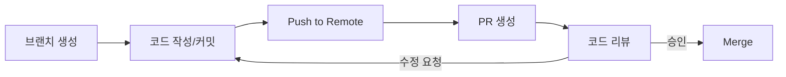
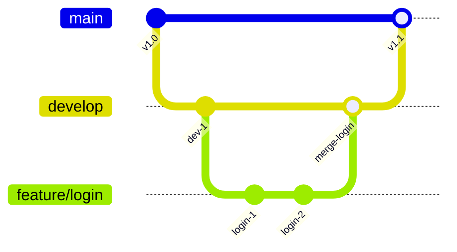

# GitHub 협업 - PR, Issue, 프로젝트 관리

## 핵심 개념

> [!summary] 요약
> GitHub를 활용한 팀 협업 워크플로우를 학습한다. Pull Request(PR)를 통한 코드 리뷰, Issue를 통한 작업 추적, GitHub Projects를 활용한 프로젝트 관리, 그리고 브랜치 전략(Git Flow)을 다룬다.

## 주요 내용

### 1. GitHub for Collaboration

**GitHub란?**
- [[Git]] 기반의 원격 협업 플랫폼
- 코드 호스팅, 코드 리뷰, 이슈 추적, CI/CD 등 통합 제공

**Fork와 Clone의 차이**
| 개념 | 설명 |
|------|------|
| **Fork** | 다른 사람의 저장소를 내 계정으로 복사 (원본과 독립) |
| **Clone** | 저장소를 로컬에 복제 (원본과 연결) |

### 2. Pull Request (PR)

- 브랜치에서 작업한 내용을 main에 합치기 전에 **코드 리뷰를 요청**하는 과정
- 팀 협업의 핵심 워크플로우

**PR 워크플로우**

**좋은 PR 작성법**
- 제목: 변경 내용을 한 줄로 요약
- 본문: 무엇을/왜 변경했는지, 테스트 방법
- 작은 단위로 PR을 나누어 리뷰 부담 감소

### 3. Issue 관리

- **Issue**: 버그 리포트, 기능 요청, 작업 추적 등을 기록하는 단위
- 라벨(Label)로 분류: `bug`, `feature`, `enhancement`, `documentation`
- Assignee로 담당자 지정
- Milestone로 마일스톤(릴리스) 그룹핑

### 4. GitHub Projects

- 칸반(Kanban) 보드 형식의 프로젝트 관리 도구
- 상태 컬럼: `To Do` -> `In Progress` -> `Done`
- Issue와 PR을 카드로 연결하여 진행 상황 시각화
- 팀 전체의 작업 현황을 한눈에 파악

### 5. 브랜치 전략 (Git Flow)

| 브랜치 | 역할 |
|--------|------|
| `main` | 배포 가능한 안정 코드 |
| `develop` | 개발 중인 코드 통합 |
| `feature/*` | 새 기능 개발 |
| `hotfix/*` | 긴급 버그 수정 |
| `release/*` | 릴리스 준비 |

### 6. 코드 리뷰 문화

- **목적**: 코드 품질 향상, 지식 공유, 버그 사전 발견
- **원칙**: 코드를 비판하되 사람을 비판하지 않음
- **피드백**: 구체적이고 건설적인 코멘트
- **자동화**: CI/CD와 연동하여 테스트 자동 실행

## 연결된 개념
- [[Git]] - GitHub의 기반이 되는 버전 관리 시스템
- [[Docker]] - Day 04에서 학습할 배포 인프라
