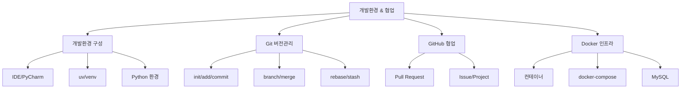

# Week 03 - 개발환경, Git, Docker

> [!summary] 주차 개요
> 실무 개발 환경을 구성하고 협업 도구를 익히는 주차. IDE/Python 개발환경(PyCharm, uv)부터 Git 기본/심화/협업, GitHub를 활용한 프로젝트 관리, Docker 인프라와 MySQL 데이터베이스까지 다룬다.

## 강의 노트

| 일차 | 제목 | 핵심 주제 |
|------|------|----------|
| Day 01 | [[W03D01-개발환경-구성]] | IDE, Python 개발환경, uv, PyCharm |
| Day 02 | [[W03D02-Git-기본-심화]] | Git 설치, init/add/commit, branch, merge, rebase |
| Day 03 | [[W03D03-GitHub-협업]] | GitHub, PR, Issue, 프로젝트 관리 |
| Day 04 | [[W03D04-Docker-MySQL]] | Docker, 컨테이너, docker-compose, MySQL |

## 핵심 개념 맵

## 연결된 개념
- [[Git]] - 분산 버전 관리 시스템
- [[GitHub]] - Git 기반 협업 플랫폼
- [[Docker]] - 컨테이너 기반 가상화
- [[MySQL]] - 관계형 데이터베이스
