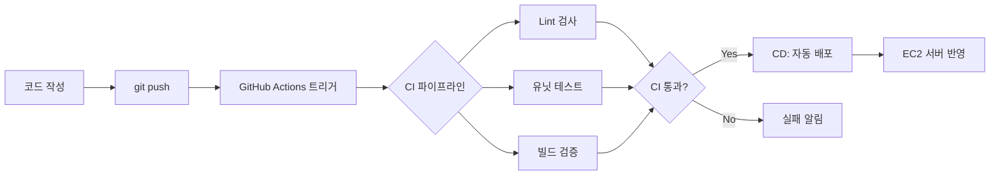

# 클라우드 배포 자동화

## 핵심 개념

> [!summary] 요약
> 배포란 코드를 제품으로 변환하여 서버에 반영하는 과정이다. 수동 배포의 문제점(시간 소모, 실수, 기록 부재)을 해결하기 위해 GitHub Actions를 활용한 배포 자동화를 학습한다. CI(지속적 통합)는 빌드 검증을, CD(지속적 배포)는 검증된 코드의 자동 배포를 담당한다. 유닛 테스트와 pytest 기초도 다룬다.

## 주요 내용

### 1. 배포란?
- **배포**: 개발된 소프트웨어를 사용자가 사용할 수 있도록 서비스하는 과정
- 코드 변경 내용을 서버에 반영하는 과정
- git/github을 통해 clone, push, pull 후 EC2에 올리고 실행
- 관련: [[배포]]

### 2. 일관성 있는 배포의 필요성
- 수동 배포의 문제: SSH 접속 -> git pull -> 설치 -> 재시작
  - 시간 소모, 실수 가능성, 배포 기록 부재, 롤백 기준 애매
- **배포 자동화** 필요성
- 관련: [[CI/CD]]

### 3. GitHub Actions
- GitHub이 제공하는 **자동화 플랫폼**
- push 이벤트 기반 실행
- YAML 기반 **Workflow** 작성
- 구성 요소: **Action**(개별 작업 단위), **Runner**(실행 컴퓨팅 리소스), **Package**(빌드 결과물)
- 관련: [[GitHub Actions]]

### 4. CI: 지속적 통합 (Continuous Integration)
- 코드의 **건강검진** 역할
- Lint 검사, 타입 검사(mypy), **유닛 테스트**, 패키지 빌드 검증
- 빌드 후 결과물 저장소에 업로드 -> 버전 관리/롤백
- 관련: [[CI/CD]]

### 5. CD: 지속적 배포 (Continuous Delivery/Deployment)
- 검증된 코드를 자동으로 **배포**하는 과정
- 스테이징/프로덕션 배포, 수동 승인, 롤백 전략
- 관련: [[CI/CD]]

### 6. 유닛 테스트
- **pytest**를 활용한 테스트 자동화
- 배포를 위한 AWS 작업 연계
- 관련: [[유닛 테스트]], [[pytest]]

## 흐름도

## 연결된 개념
- [[CI/CD]]
- [[GitHub Actions]]
- [[배포]]
- [[유닛 테스트]]
- [[pytest]]
