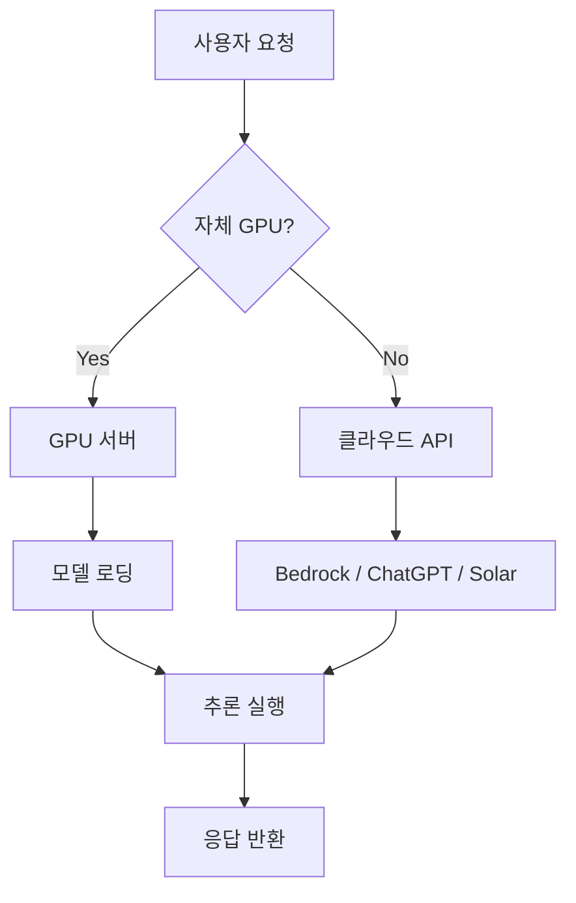

# 네트워크와 AI

## 핵심 개념

> [!summary] 요약
> AI 서비스를 운영하려면 GPU 인프라에 대한 이해가 필수적이다. GPU는 귀하고 비싼 자원으로, 모델 로딩에 시간이 걸리며 메모리 관리가 중요하다. AI가 있는 서비스 아키텍처, RAG 개념, 클라우드를 통한 AI 서비스 운영 방법(Amazon Bedrock, ChatGPT API, Solar LLM)을 다룬다.

## 주요 내용

### 1. GPU 운영 기초
- GPU는 **귀하고 비싼** 컴퓨터 자원
- 일반 서버는 금방 생기지만 GPU 서버는 수량 적고 예약 어려움
- GPU는 켜는 데 시간이 더 오래 걸림: NVIDIA 드라이버, CUDA, cuDNN 초기화
- 모델 파일(수십 GB)을 GPU 메모리에 올리는 과정 오래 걸림
- **Cold start** 문제: 첫 요청 처리 시 지연
- 관련: [[GPU 운영]]

### 2. GPU 장애 원인
- GPU는 열/메모리/연산 구조가 민감한 특수 장치
- 동시 연산 처리가 많아 **발열** 큼 -> 냉각 시스템 중요
- GPU 메모리가 비싸고 LLM은 메모리를 많이 사용
- 긴 프롬프트 -> 쉽게 **OOM (Out Of Memory)**
- Multi-GPU 환경에서 통신 지연 문제
- CUDA, PyTorch 등 **버전 충돌**
- 관련: [[GPU 운영]]

### 3. GPU 효율적 사용
- 요청을 묶어서 **배치 처리** (한 번에 많이 계산하면 효율적)
- GPU 하나에 여러 모델 올리면 메모리 단편화, OOM 위험
- GPU 가상화 기술 발전 중 (예: AWS Bedrock)
- **NV LINK**: 모델의 한 층을 여러 GPU가 나눠 계산
- 관련: [[GPU 운영]]

### 4. AI가 있는 서비스 아키텍처
- AI 서비스 구조 이해
- **RAG**(Retrieval-Augmented Generation) 개념
- AI 클라우드와 Vector DB를 통한 AI 서비스 연동
- 관련: [[RAG]], [[AI 아키텍처]]

### 5. 현실적으로 AI를 사용하는 방법
- GPU 없이도 **클라우드를 통해** AI 서비스 운영 가능
- Amazon Bedrock, ChatGPT API, Solar LLM LLM
- 관련: [[클라우드 컴퓨팅]], [[LLM API]]

## 흐름도

## 연결된 개념
- [[GPU 운영]]
- [[RAG]]
- [[클라우드 컴퓨팅]]
- [[AI 아키텍처]]
- [[LLM API]]
