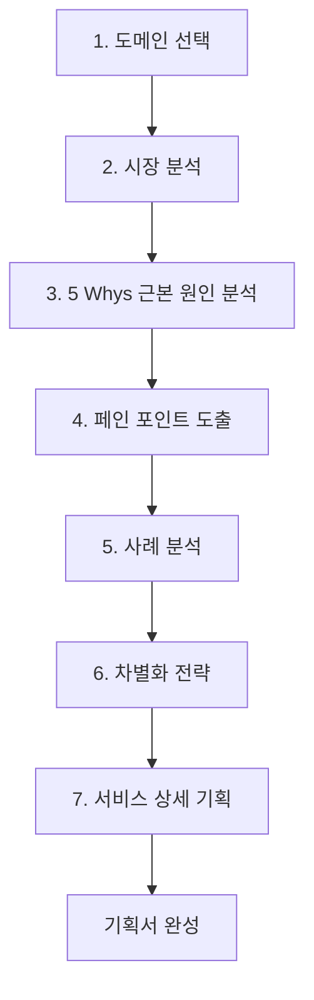

# AI 서비스 기획 가이드

## 핵심 개념

> [!summary] 요약
> AI 서비스 기획의 전 과정을 체계적으로 다루는 가이드. 도메인 선택, 시장 분석, 5 Whys 근본 원인 분석, 페인 포인트 도출, 사례 분석, 차별화 전략, 서비스 상세 기획까지의 단계별 방법론을 제시한다. 뉴스 챗봇 에이전트 샘플과 운동버디(Fitness Buddy) 사례를 통해 실제 적용 사례를 보여준다.

## 주요 내용

### 1. 도메인 선택 및 시장 분석

- **도메인 탐색 방법**: 개인 경험, 트렌드 리서치, LLM 활용 아이디어 발굴
- **문제 구체화**: "현상 -> 원인 -> 영향" 구조로 정리
- **AI 도입 필요성 정당화**: 대량 데이터 처리, 패턴 인식, 자연어 이해/생성, 개인화, 실시간 대응
- **시장 규모 조사**: Statista, 통계청, 증권사 리포트, LLM Deep Research 활용

### 2. 근본 원인 분석 (5 Whys)

- 도요타에서 개발된 문제 분석 방법론
- "왜?"를 5번 연속으로 물어 근본 원인에 도달
- **검증 질문**: 근본 원인 해결 시 현상 개선 여부, AI 기술로 해결 가능한 영역인지 확인
- 사람이 아닌 **시스템에 집중**하는 것이 핵심

### 3. 페인 포인트와 기회 매핑

| AI 역량 | 해결 가능한 페인 포인트 |
|--------|------------------------|
| 정보 검색 & 취합 | 흩어진 정보를 찾기 어려움 |
| 요약 & 정리 | 긴 콘텐츠를 읽어야 하는 시간 부담 |
| 개인화 & 추천 | 관련 없는 정보에 노출되는 피로 |
| 대화형 인터페이스 | 복잡한 UI를 학습해야 하는 부담 |
| 맥락 이해 & 연결 | 파편화된 정보 사이 관계 파악의 어려움 |

### 4. 기획서 샘플: 뉴스 챗봇 에이전트 (Newzi)

- **서비스 정의**: 사용자의 뉴스 소비 패턴을 학습하여 관심사에 맞는 개인 맞춤형 뉴스 비서
- **핵심 가치**: 시간 절약, 개인화, 맥락 이해, 신뢰성
- **차별화 전략**: 실시간 뉴스 동기화, 메모리 시스템, 뉴스 데이터 취합 및 맥락 재구성, 멀티 도구 오케스트레이션
- **Agentic Workflow 필요성**: 단일 추론 한계 극복, 도구 활용, 자기 반성, 멀티 에이전트 협업

### 5. 사례: 운동버디 (Fitness Buddy)

- 40대를 위한 마이크로 피트니스 습관 형성 솔루션
- 피트니스 앱 6개월 내 90% 이탈 문제 해결
- **3가지 핵심 엔진**: AI 큐레이터, 버디 챌린지, 게이미피케이션
- **비즈니스 모델**: B2C 프리미엄 + B2B2C (기업 웰니스, 보험사 제휴)
- 바이럴 루프를 통한 CAC 감소 & LTV 증가 전략

## 흐름도

## 연결된 개념

- [[W07-Workflow-Design]]
- [[W07-Agent-개발-팁]]
- [[W06-Agentic-Workflow-개요]]
