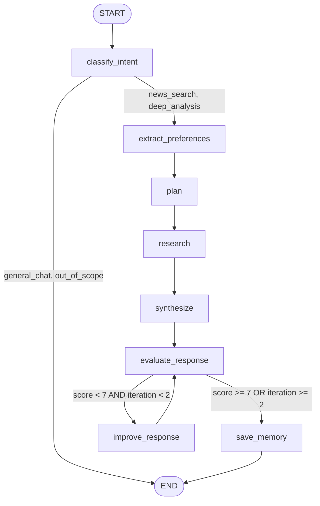

# AI Workflow Design

## 핵심 개념

> [!summary] 요약
> Agentic Workflow 설계서 작성 가이드. 서비스 기획서가 "무엇을 만들 것인가"를 정의한다면, 워크플로우 설계서는 "어떻게 동작하게 할 것인가"를 정의한다. LangGraph/LangChain 프레임워크를 활용한 구현 전 설계 문서 작성법을 다룬다.

## 주요 내용

### 1. 서비스 개요 정의

- **핵심 목적**: 사용자에게 제공할 가치를 기술적 관점에서 정의
- **인지 노동 분석**: 에이전트 없이 사용자가 수행해야 할 수동 작업을 구체적으로 나열
- **해결 과제 식별**: Critical / High / Medium / Low로 우선순위 분류

| 도전 과제 | 설명 |
|--------|------|
| 할루시네이션 | LLM이 사실이 아닌 정보를 생성 |
| 정보 최신성 | 모델 학습 이후 정보를 알지 못함 |
| 컨텍스트 유실 | 긴 대화에서 앞선 맥락을 잊음 |
| 워크플로우 이탈 | 에이전트가 의도한 경로를 벗어남 |
| 도구 호출 실패 | 외부 API 연동 실패 |

### 2. 시스템 아키텍처

- **상호작용 흐름**: 입력 -> 처리 -> 출력 -> (피드백)
- **Mermaid 다이어그램**: subgraph로 사용자/에이전트/도구 영역을 분리하여 시각화
- **노드 식별**: classify_intent, extract_preferences, plan, research, synthesize, evaluate_response, improve_response, save_memory

### 3. 워크플로우 상세 설계

- **노드별 역할 정의**: 입출력, LLM 사용 여부, 분기 조건 명세
- **분기 조건**: intent 유형에 따른 라우팅, 품질 점수에 따른 개선 루프
- **State 객체 설계**: Python TypedDict 기반, Annotated[list, add]로 누적 관리

> [!tip] 핵심 분기 로직
> - `classify_intent`: general_chat/out_of_scope -> END, news_search/deep_analysis -> extract_preferences
> - `evaluate_response`: score >= 7 OR iteration >= 2 -> save_memory, score < 7 AND iteration < 2 -> improve_response

### 4. 구현 전략

| 전략 영역 | 핵심 |
|--------|------|
| 컨텍스트 엔지니어링 | Annotated[list, add]로 대화/도구 결과 누적, 토큰 초과 시 요약 |
| 메모리 관리 | InMemoryStore로 사용자 관심사/이력을 딕셔너리로 구조화 |
| 평가-최적화 루프 | 정확성/관련성/완성도/가독성 기준 7점 임계치, 최대 2회 개선 |

### 5. 구현 시 고려 사항

- **비용**: LLM 대화당 최소 6~8회 호출, 웹 검색 API 비용
- **응답 시간**: 전체 시스템 9~15초 (루프 가동 횟수에 따라 가변)
- **위험 관리**: 할루시네이션(RAG 우선), API 장애(폴백+재시도), 무한 루프(최대 반복 제한)

## 흐름도

## 연결된 개념

- [[W07-AI-서비스-기획]]
- [[W07-Agent-개발-팁]]
- [[W08D01-Agent-Architecture]]
