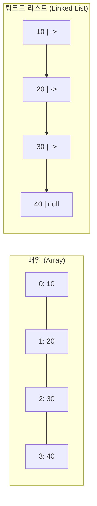

# 알고리즘 분석 기초 - Big-O, 배열, 링크드 리스트

## 핵심 개념

> [!summary] 요약
> 알고리즘이란 문제를 풀기 위한 단계적 절차이며, 효율성을 Big-O 표기법으로 측정한다. 가장 기본적인 자료구조인 배열(Array)과 링크드 리스트(Linked List)를 학습하고, 각각의 시간 복잡도를 비교한다.

## 주요 내용

### 1. 알고리즘이란?

- **정의**: 문제를 풀기 위한 단계적 절차(Problem Solving Procedure)
- 컴퓨터에서 특정 문제를 풀 때 필요한 단계/프로시저를 포멀하게 정한 구조
- 핵심 목표: **빠르고 효율적인** 문제 해결

### 2. 시간 복잡도와 Big-O 표기법

- 알고리즘의 효율성을 측정하는 도구
- 입력 크기(n)가 커질 때 실행 시간이 어떻게 변하는지를 표현

> [!key-concept] 주요 Big-O 등급
> | 표기 | 이름 | 예시 |
> |------|------|------|
> | O(1) | 상수 시간 | 배열 인덱스 접근 |
> | O(log n) | 로그 시간 | 이진 탐색 |
> | O(n) | 선형 시간 | 순차 탐색 |
> | O(n log n) | 선형로그 시간 | 효율적 정렬(머지소트) |
> | O(n^2) | 이차 시간 | 버블 소트 |

### 3. 배열 (Array)

- **정의**: 연속된 메모리 박스에 데이터를 시퀀스 형태로 저장하는 구조
- 파이썬에서는 **리스트(list)**로 구현
- **길이(Length)**: 초기화 시 할당되는 메모리의 크기 (N개 엘레멘트 저장)
- **인덱스 접근**: `A[i]`로 i번째 엘레멘트에 O(1)로 접근

**배열의 시간 복잡도**
| 연산 | 복잡도 | 비고 |
|------|--------|------|
| 접근 (Access) | O(1) | 인덱스로 직접 접근 |
| 탐색 (Search) | O(n) | 순차 탐색 시 |
| 삽입 (Insert) | O(n) | 요소 이동 필요 |
| 삭제 (Delete) | O(n) | 요소 이동 필요 |

### 4. 링크드 리스트 (Linked List)

- **정의**: 각 노드가 데이터와 다음 노드에 대한 참조(포인터)를 가지는 구조
- 배열과 달리 **연속된 메모리가 필요하지 않음**
- 노드(Node) 구성: `value` + `next` 포인터

**링크드 리스트의 시간 복잡도**
| 연산 | 복잡도 | 비고 |
|------|--------|------|
| 접근 (Access) | O(n) | 처음부터 순회 |
| 탐색 (Search) | O(n) | 처음부터 순회 |
| 삽입 (Insert, head) | O(1) | head에 추가 시 |
| 삭제 (Delete, head) | O(1) | head 제거 시 |

## 연결된 개념
- [[Big-O]] - 알고리즘 효율성 측정
- [[스택]] - 배열/링크드 리스트 기반 구현
- [[큐]] - 배열/링크드 리스트 기반 구현
