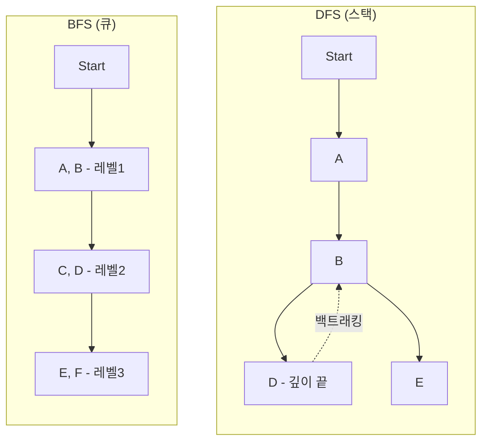

# 트리, 그래프, DFS/BFS 탐색

## 핵심 개념

> [!summary] 요약
> 비선형 자료구조인 트리와 그래프를 학습한다. 트리는 계층 구조를 표현하며, BST(이진 탐색 트리)에서 검색/삽입/삭제가 높이(h)에 비례한다. 그래프는 연결(관계)을 모델링하는 범용 구조이며, DFS(스택)와 BFS(큐)로 탐색한다.

## 주요 내용

### 1. 트리 (Tree) - 계층 구조의 비선형 자료구조

- 데이터가 **부모-자식** 관계로 연결되는 구조 (폴더 구조, DOM, 의사결정 흐름 등)
- **시작점(루트)**이 있고, 각 노드는 여러 자식을 가질 수 있음

**기본 용어**
| 용어 | 설명 |
|------|------|
| Node(노드) | 데이터가 담기는 "점" |
| Root(루트) | 트리의 시작 노드(최상단) |
| Leaf(리프) | 자식이 없는 노드 |
| Height(높이) | 루트에서 가장 깊은 리프까지의 층수 |
| Subtree(서브트리) | 어떤 노드를 루트로 하는 부분 트리 |

### 2. 바이너리 트리 & BST

- **바이너리 트리(이진 트리)**: 각 노드가 최대 2개의 자식(Left/Right)을 갖는 트리
- **완전 이진 트리**: 위에서 아래로, 왼쪽부터 빈칸 없이 채워지는 형태 -> **배열로 표현** 가능
  - 왼쪽 자식: `2*i + 1`, 오른쪽 자식: `2*i + 2`, 부모: `floor((i-1)/2)`

- **BST (Binary Search Tree)**: 정렬 규칙이 있는 특별한 이진 트리
  - 왼쪽 서브트리에는 더 작은 값, 오른쪽 서브트리에는 더 큰 값

> [!key-concept] BST 성능은 "높이(height)"가 결정한다
> - 밸런스 잘 잡힌 경우: h ~ log n -> **O(log n)**
> - 한쪽으로 기울면(스큐드 트리): h ~ n -> **O(n)**
> - 밸런싱 기법: AVL Tree, Red-Black Tree

**BST 삭제 3가지 케이스**
1. **리프 노드**: 그냥 제거
2. **자식 1개**: 자식 노드를 올려서 연결
3. **자식 2개**: 오른쪽 서브트리에서 가장 작은 값(successor)을 찾아 교체 후 삭제

### 3. 그래프 (Graph) - 연결을 모델링하는 범용 구조

- **G = (V, E)**: 정점(Vertices)과 간선(Edges)의 집합
- 트리보다 더 일반적인 비선형 구조 (지하철 노선도, 친구 관계, 웹 링크 등)

**그래프 성질/종류**
| 구분 | 설명 |
|------|------|
| Connected / Disconnected | 모든 정점에서 다른 모든 정점으로 경로 존재 여부 |
| Cycle | 시작점으로 돌아오는 루프 존재 여부 |
| Directed / Undirected | 간선에 방향이 있는지 여부 |

**저장 방법**
| 방식 | 장점 | 단점 |
|------|------|------|
| 인접 행렬 (Adjacency Matrix) | 연결 확인 빠름 O(1) | 메모리 O(n^2) |
| 인접 리스트 (Adjacency List) | 메모리 O(V+E) 효율적 | 연결 확인에 순회 필요 |

### 4. DFS (깊이 우선 탐색) - 스택 기반

- **한 갈래로 끝까지** 들어가 보고, 막히면 되돌아오는(백트래킹) 탐색
- **스택** 또는 재귀(recursion)로 구현
- `visited` 관리 필수 (사이클에서 무한 루프 방지)

### 5. BFS (너비 우선 탐색) - 큐 기반

- 현재 정점에서 **가까운 것(같은 레벨)** 부터 차례대로 넓게 탐색
- **큐**를 사용하여 "먼저 들어온 정점부터" 처리
- 무가중치 그래프에서 **최단 거리(최소 간선 수) 경로**를 찾는 데 연결

### 6. 확장: 위상 정렬 (Topological Sorting)

- 선후관계(의존성)가 있는 작업들을 "안전한 순서"로 나열
- 전제: **사이클이 없는 방향 그래프(DAG)**
- 코딩 인터뷰에서는 DFS/BFS가 더 자주 출제

## 연결된 개념
- [[BST]] - 이진 탐색 트리, 검색/삽입/삭제
- [[DFS]] - 깊이 우선 탐색, 백트래킹
- [[BFS]] - 너비 우선 탐색, 최단 경로
- [[스택]] - DFS 구현에 사용
- [[큐]] - BFS 구현에 사용
