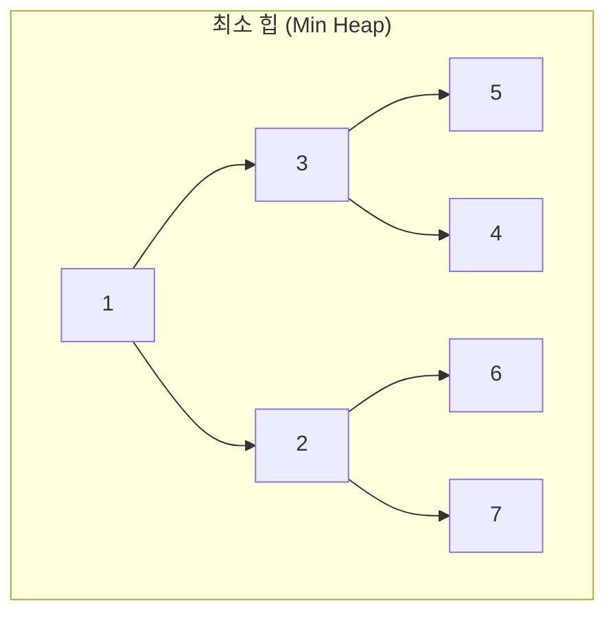

# 우선순위 큐, 힙, 재귀호출, 탐색 알고리즘

## 핵심 개념

> [!summary] 요약
> 우선순위 큐를 효율적으로 구현하는 힙(Heap) 자료구조와, 문제를 작은 부분으로 쪼개어 해결하는 재귀호출(Recursion), 그리고 선형 탐색과 이진 탐색(Binary Search) 알고리즘을 학습한다.

## 주요 내용

### 1. 우선순위 큐 (Priority Queue)

- **개념**: 일반 큐와 달리 **우선순위가 높은 데이터가 먼저 나가는** 구조
- FIFO가 아닌, 우선순위(최솟값 또는 최댓값) 기반으로 dequeue
- 배열/링크드 리스트로 구현 시 삽입 또는 삭제 중 하나가 O(n)

### 2. 힙 (Heap)

- 우선순위 큐를 효율적으로 구현하는 **완전 이진 트리** 기반 구조
- **최소 힙 (Min Heap)**: 부모 노드가 자식보다 항상 작거나 같음
- **최대 힙 (Max Heap)**: 부모 노드가 자식보다 항상 크거나 같음

**핵심 연산**
| 연산 | 복잡도 | 설명 |
|------|--------|------|
| 삽입 (Insert) | O(log n) | 맨 아래에 추가 후 위로 올림 (heapify up) |
| 삭제 (Extract) | O(log n) | 루트 제거 후 맨 아래를 루트에 놓고 아래로 내림 (heapify down) |
| 최솟값/최댓값 조회 | O(1) | 루트 노드 |

- **배열로 구현**: 완전 이진 트리이므로 배열 인덱스 규칙 그대로 사용
  - 왼쪽 자식: `2*i + 1`, 오른쪽 자식: `2*i + 2`, 부모: `(i-1) // 2`

### 3. 재귀호출 (Recursion)

- **개념**: 함수가 자기 자신을 호출하는 프로그래밍 기법
- 복잡한 문제를 **같은 구조의 작은 문제**로 쪼개어 해결

**재귀의 핵심 구성**
1. **Base Case (기저 조건)**: 재귀를 멈추는 조건 -- 없으면 무한 루프
2. **Recursive Case (재귀 호출)**: 문제를 작은 단위로 쪼개어 자기 자신을 호출

**대표 예시**
- 팩토리얼: `n! = n * (n-1)!`, base case: `0! = 1`
- 피보나치: `fib(n) = fib(n-1) + fib(n-2)`, base case: `fib(0)=0, fib(1)=1`
- 트리 순회, BST 삽입/삭제, DFS

### 4. 탐색 알고리즘 (Searching)

- **정의**: 자료 구조에서 원하는 값이 존재하는지, 존재한다면 어디에 있는지를 찾는 것

**선형 탐색 (Linear Search)**
- 처음부터 끝까지 하나씩 확인
- 시간 복잡도: **O(n)**

**이진 탐색 (Binary Search)**
- **정렬된 배열**에서만 사용 가능
- 중간값과 비교하여 탐색 범위를 반씩 줄여감
- 시간 복잡도: **O(log n)**

> [!key-concept] 이진 탐색의 전제 조건
> 데이터가 **정렬되어 있어야** 한다. 정렬되지 않은 데이터에는 사용할 수 없다.

## 연결된 개념
- [[힙]] - 우선순위 큐의 효율적 구현
- [[BST]] - 재귀적 삽입/삭제/탐색
- [[Big-O]] - O(log n) 이진 탐색의 효율성
