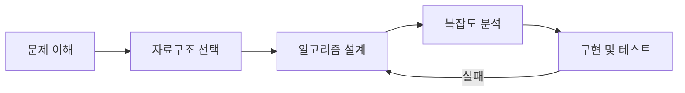

# 정렬 알고리즘과 코딩 문제 풀이

## 핵심 개념

> [!summary] 요약
> 대표적인 정렬 알고리즘(버블, 선택, 삽입, 머지, 퀵)의 원리와 시간 복잡도를 비교하고, 자료구조와 알고리즘을 종합하여 코딩 문제를 풀이하는 전략을 학습한다.

## 주요 내용

### 1. 정렬 알고리즘 개요

- **정렬(Sorting)**: 데이터를 특정 기준(오름차순/내림차순)으로 재배열
- 탐색 효율을 높이고, 데이터 분석의 기반이 되는 핵심 알고리즘

### 2. O(n^2) 정렬 -- 기초 정렬

**버블 소트 (Bubble Sort)**
- 인접한 두 원소를 비교하여 교환하며, 큰 값이 뒤로 "버블"처럼 이동
- 최악/평균: O(n^2)

**선택 소트 (Selection Sort)**
- 매번 남은 원소 중 최솟값을 찾아 앞으로 이동
- 최악/평균: O(n^2)

**삽입 소트 (Insertion Sort)**
- 현재 원소를 이미 정렬된 부분의 적절한 위치에 삽입
- 거의 정렬된 데이터에 효율적
- 최악: O(n^2), 최선: O(n)

### 3. O(n log n) 정렬 -- 효율적 정렬

**머지 소트 (Merge Sort)**
- **분할 정복(Divide & Conquer)**: 반으로 쪼개고, 정렬된 부분을 합침
- 항상 O(n log n) 보장
- 추가 메모리 O(n) 필요 (Not in-place)

**퀵 소트 (Quick Sort)**
- 피벗(pivot) 기준으로 작은 값/큰 값을 양쪽으로 분할
- 평균: O(n log n), 최악: O(n^2) (피벗 선택에 따라)
- 실무에서 가장 많이 사용 (In-place 가능)

> [!key-concept] 정렬 알고리즘 비교
> | 알고리즘 | 최선 | 평균 | 최악 | 공간 | 안정성 |
> |----------|------|------|------|------|--------|
> | 버블 소트 | O(n) | O(n^2) | O(n^2) | O(1) | 안정 |
> | 선택 소트 | O(n^2) | O(n^2) | O(n^2) | O(1) | 불안정 |
> | 삽입 소트 | O(n) | O(n^2) | O(n^2) | O(1) | 안정 |
> | 머지 소트 | O(n log n) | O(n log n) | O(n log n) | O(n) | 안정 |
> | 퀵 소트 | O(n log n) | O(n log n) | O(n^2) | O(log n) | 불안정 |

### 4. 코딩 문제 풀이 전략

1. **문제 이해**: 입력/출력 형식, 제약 조건 파악
2. **자료구조 선택**: 문제 특성에 맞는 자료구조 결정
3. **알고리즘 설계**: 브루트포스 -> 최적화 순서로 접근
4. **복잡도 분석**: 시간/공간 복잡도가 제약 조건 내인지 확인
5. **구현 및 테스트**: 엣지 케이스(빈 입력, 최댓값, 중복 등) 확인

## 연결된 개념
- [[Big-O]] - 정렬 알고리즘의 시간 복잡도 비교
- [[분할-정복]] - 머지 소트, 퀵 소트의 핵심 전략
- [[이진-탐색]] - 정렬된 데이터에서의 효율적 탐색
