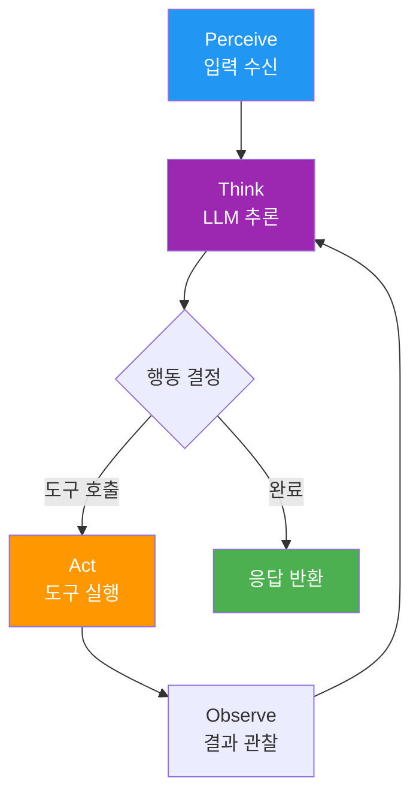

# Agent Architecture

> [!info] 한줄 정의
> LLM 기반 자율 에이전트의 구조와 설계 패턴. 지각-추론-행동 루프를 반복하며 복잡한 목표를 자율적으로 달성한다.

## 핵심 이해

에이전트의 핵심은 **ReAct(Reasoning + Acting)** 패턴이다. LLM이 생각(Thought)을 생성하고, 행동(Action)을 결정하며, 관찰(Observation)을 통해 다음 단계를 결정하는 루프를 반복한다. 이 패턴은 단순한 체인과 달리 동적인 의사결정이 가능하다.

**Plan-and-Execute** 패턴은 복잡한 작업을 위한 고급 아키텍처다. 플래너(Planner)가 전체 실행 계획을 수립하고, 실행자(Executor)가 각 단계를 수행한다. 멀티 에이전트 시스템에서는 Supervisor 에이전트가 여러 Worker 에이전트를 조율하는 계층 구조를 형성한다.

메모리 관리는 에이전트 설계의 핵심 요소다. 단기 메모리(대화 버퍼), 장기 메모리(벡터 DB), 에피소드 메모리(과거 경험), 의미 메모리(도메인 지식)의 네 가지 유형을 목적에 맞게 조합한다. 도구(Tool) 사용 능력은 에이전트의 실행 범위를 크게 확장한다.

## 관련 강의

- [[W08D01-Agent-Architecture]]
- [[W06D01-AI-서비스-에이전트-설계]]

## 에이전트 루프 다이어그램

## 관련 개념

- [[Agentic-Workflow]] - 에이전트 기반 워크플로우 패턴
- [[LangGraph]] - 에이전트 구현 프레임워크
- [[Tool-Calling]] - 외부 도구 연동
- [[Memory-Management]] - 에이전트 메모리 설계
- [[Agent-Evaluation]] - 에이전트 성능 평가

## 참고 자료

- [LLM Powered Autonomous Agents (Lilian Weng)](https://lilianweng.github.io/posts/2023-06-23-agent/)
- [ReAct: Synergizing Reasoning and Acting in Language Models](https://arxiv.org/abs/2210.03629)
