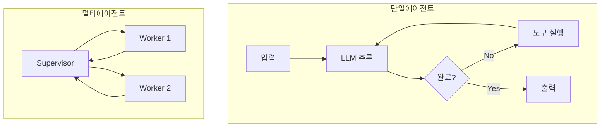

# Agentic Workflow

> [!info] 한줄 정의
> LLM 에이전트가 자율적으로 작업을 계획하고 실행하는 워크플로우. 단순 체인을 넘어 동적 의사결정과 반복 실행이 가능하다.

## 핵심 이해

Agentic Workflow는 단일 에이전트와 멀티 에이전트 두 가지 형태로 구성된다. 단일 에이전트는 ReAct 루프로 작업을 처리하고, 멀티 에이전트는 Supervisor-Worker 계층으로 복잡한 작업을 분산 처리한다. 각 에이전트는 전문화된 역할을 가지며 메시지 패싱으로 소통한다.

핵심 패턴으로는 **Reflection**(자기 검토 및 개선), **Planning**(단계별 계획 수립), **Tool Use**(외부 도구 활용), **Orchestration**(멀티 에이전트 조율)이 있다. LangGraph는 이러한 패턴들을 그래프 구조로 구현하는 데 최적화되어 있다.

## 관련 강의

- [[W06D01-AI-서비스-에이전트-설계]]
- [[W07-Workflow-Design]]

## 워크플로우 패턴

## 관련 개념

- [[Agent-Architecture]] - 에이전트 설계 원칙
- [[LangGraph]] - 워크플로우 구현 프레임워크
- [[Tool-Calling]] - 도구 통합 메커니즘
- [[Agentic-RAG]] - RAG와 에이전트 결합

## 참고 자료

- [Agentic AI Design Patterns (Andrew Ng)](https://www.deeplearning.ai/the-batch/agentic-design-patterns-part-1-reflection/)
