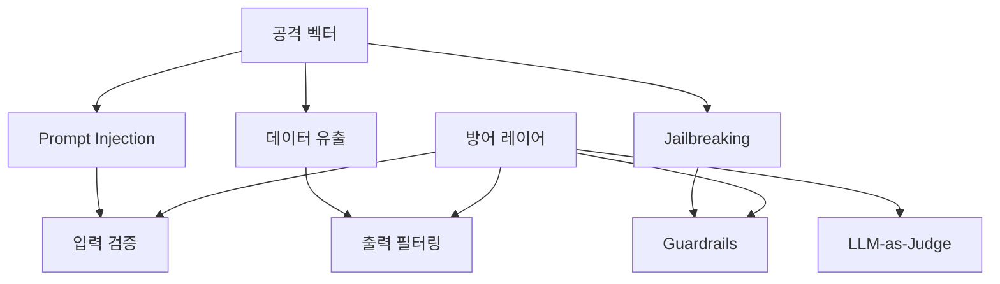

# LLM 보안

> [!info] 한줄 정의
> LLM 기반 시스템의 보안 취약점과 방어 전략. 프롬프트 조작, 데이터 유출, 악의적 행동을 방지하기 위한 설계 원칙이다.

## 핵심 이해

**Prompt Injection**은 가장 대표적인 LLM 보안 위협이다. 사용자가 악의적인 지시를 입력하여 시스템 프롬프트를 무력화하거나 의도치 않은 동작을 유발한다. Direct Injection(직접 주입)과 Indirect Injection(RAG 문서 등을 통한 간접 주입) 두 가지 유형이 있다.

**Jailbreaking**은 모델의 안전 장치를 우회하는 기법이다. 역할극, 가상 시나리오, 토큰 조작 등 다양한 방법이 사용된다. 방어를 위해 입력 검증(Input Validation), 출력 필터링(Output Filtering), Guardrails 라이브러리, LLM-as-Judge 패턴을 활용한다.

데이터 유출 방지를 위해 시스템 프롬프트에 민감 정보를 포함하지 않고, RAG 검색 시 권한 기반 필터링을 적용해야 한다. 최소 권한 원칙(Principle of Least Privilege)을 에이전트 설계에도 적용한다.

## 관련 강의

- [[W05D04-Advanced-RAG-보안]]
- [[W06D04-Context-Engineering-Safety]]

## 공격 벡터와 방어 레이어

## 관련 개념

- [[Prompt-Engineering]] - 안전한 프롬프트 설계
- [[Context-Engineering]] - 컨텍스트 보안 설계
- [[RAG]] - RAG 시스템의 보안 고려사항
- [[Agent-Evaluation]] - 보안 관점의 에이전트 평가

## 참고 자료

- [OWASP Top 10 for LLM Applications](https://owasp.org/www-project-top-10-for-large-language-model-applications/)
- [Prompt Injection Attacks (Simon Willison)](https://simonwillison.net/2022/Sep/12/prompt-injection/)
