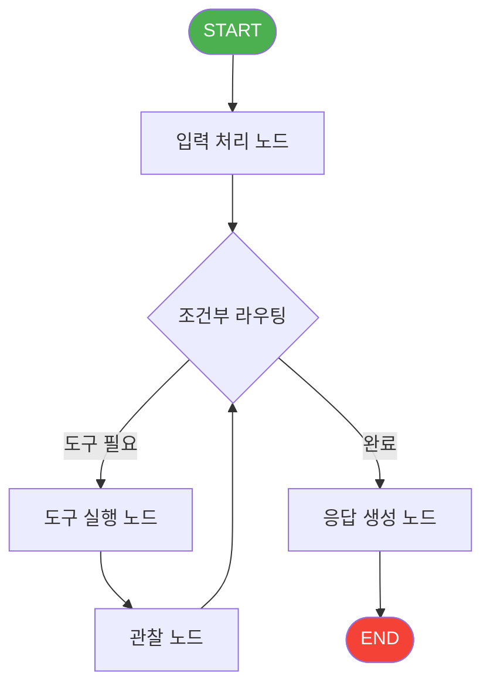

# LangGraph

> [!info] 한줄 정의
> LangChain 기반의 상태 기계(State Machine) 에이전트 프레임워크. 노드와 엣지로 구성된 그래프로 복잡한 에이전트 워크플로우를 정의하고 실행한다.

## 핵심 이해

LangGraph의 핵심 개념은 **노드(Node)**, **엣지(Edge)**, **상태(State)** 세 가지다. 노드는 실행 가능한 함수(LLM 호출, 도구 실행 등)이고, 엣지는 노드 간의 전환 규칙을 정의하며, 상태는 그래프 실행 중 유지되는 데이터 구조다. 조건부 엣지를 통해 동적인 라우팅이 가능하다.

체크포인터(Checkpointer)는 LangGraph의 강력한 기능으로, 그래프 실행 상태를 영속화하여 중단된 작업을 재개하거나 특정 시점으로 되돌아갈 수 있게 한다. Supabase, Redis 등 다양한 백엔드를 지원한다. Human-in-the-loop 패턴 구현에 필수적이다.

LangGraph는 단일 에이전트부터 멀티 에이전트 시스템까지 구현 가능하다. Supervisor 패턴으로 여러 서브 에이전트를 조율하거나, 병렬 실행 브랜치를 통해 효율적인 작업 분배가 가능하다. idol-agent 프로젝트(Week08~09)에서 핵심 프레임워크로 사용되었다.

## 관련 강의

- [[W08D02-LangGraph-MVP]]
- [[W09D02-상태관리]]

## 아키텍처 다이어그램

## 관련 개념

- [[Agent-Architecture]] - 에이전트 설계 패턴
- [[Agentic-Workflow]] - 워크플로우 오케스트레이션
- [[상태관리]] - LangGraph 체크포인터와 상태 영속화
- [[FastAPI]] - LangGraph 앱 서빙
- [[Supabase]] - 체크포인터 백엔드

## 참고 자료

- [LangGraph Documentation](https://langchain-ai.github.io/langgraph/)
- [LangGraph Concepts](https://langchain-ai.github.io/langgraph/concepts/)
