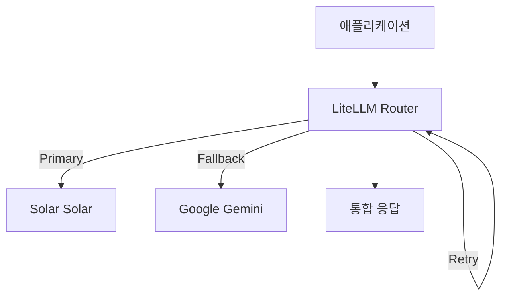

# LiteLLM

> [!abstract] 한줄 정의
> 다양한 LLM API 프로바이더를 하나의 통합 인터페이스로 연결하는 프록시 라이브러리.

## 핵심 이해

LiteLLM은 OpenAI, Anthropic, Google, Solar 등 다양한 LLM 프로바이더의 API를 통일된 인터페이스로 호출할 수 있게 해준다. Router를 통해 Primary/Fallback 모델 설정, 재시도 정책, 로드밸런싱을 지원한다.

## 관련 강의
- [[W09D01-API-이슈-LiteLLM]] - LiteLLM 통합 실습

## 구조/흐름

## 관련 개념
- [[FastAPI]] - API 서버와의 통합
- [[Agent-Architecture]] - 에이전트의 LLM 백엔드
