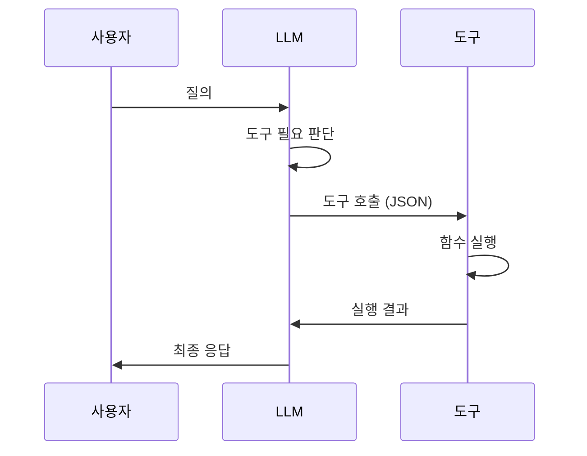

# Tool Calling

> [!info] 한줄 정의
> LLM이 외부 도구(API, 함수)를 호출하여 작업을 수행하는 기법. LLM의 텍스트 생성 능력을 실제 행동 능력으로 확장한다.

## 핵심 이해

Tool Calling(Function Calling)은 LLM이 특정 형식의 JSON 출력을 생성하면, 이를 파싱하여 실제 함수를 실행하는 메커니즘이다. 도구 스키마(Tool Schema)는 함수 이름, 파라미터, 설명을 JSON Schema로 정의한다. LLM은 이 스키마를 보고 적절한 도구를 선택한다.

실행 루프는 LLM → 도구 선택 → 함수 실행 → 결과 관찰 → LLM 순서로 반복된다. 에러 핸들링이 중요하며, 도구 실행 실패 시 LLM이 재시도하거나 대안을 선택할 수 있어야 한다. 병렬 도구 호출(Parallel Function Calling)로 여러 도구를 동시에 실행할 수도 있다.

## 관련 강의

- [[W06D02-Tool-Calling-MCP]]

## LLM-도구 상호작용

## 관련 개념

- [[MCP]] - 표준화된 도구 연결 프로토콜
- [[Agent-Architecture]] - 에이전트의 도구 사용 전략
- [[Agentic-Workflow]] - 도구 기반 워크플로우

## 참고 자료

- [OpenAI Function Calling](https://platform.openai.com/docs/guides/function-calling)
- [Anthropic Tool Use](https://docs.anthropic.com/en/docs/build-with-claude/tool-use)
