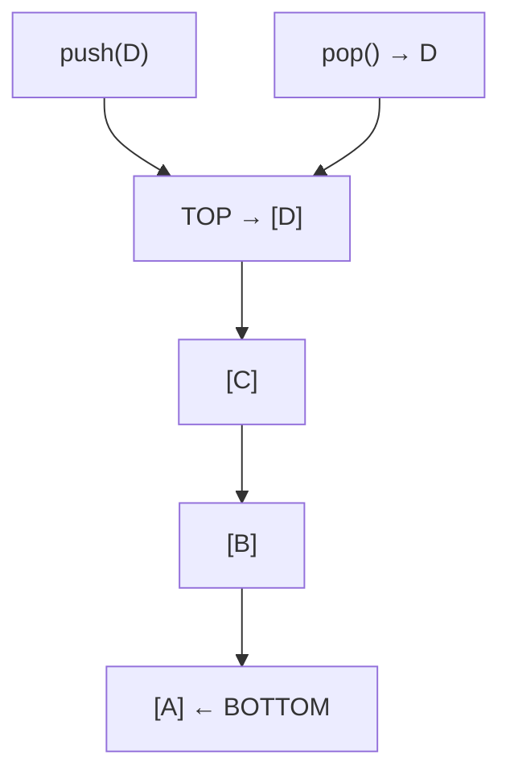

# 스택 (Stack)

> [!info] 한줄 정의
> LIFO(Last In, First Out) 구조의 선형 자료구조. 마지막에 삽입된 원소가 가장 먼저 삭제된다.

## 핵심 이해

스택의 핵심 연산은 **push**(삽입)와 **pop**(삭제)이다. `peek`으로 최상단 원소를 제거하지 않고 확인할 수 있다. Python에서는 리스트의 `append()`/`pop()`으로 스택을 구현한다.

대표적인 활용 사례로 괄호 유효성 검사, 후위 표기법(RPN) 계산, 함수 호출 스택(Call Stack), 브라우저 뒤로가기, DFS(깊이 우선 탐색) 구현이 있다. 재귀 함수는 내부적으로 호출 스택을 사용한다.

## 구조 시각화

## 관련 개념

- [[큐]] - FIFO 구조와 비교
- [[재귀]] - 콜 스택과 재귀의 관계
- [[BFS-DFS]] - DFS에서 스택 활용
