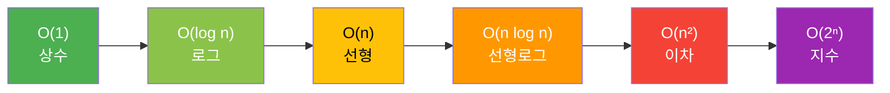

# 시간복잡도 (Time Complexity)

> [!info] 한줄 정의
> 입력 크기 n에 따라 알고리즘의 실행 시간이 어떻게 증가하는지를 Big-O 표기법으로 나타낸 척도.

## 핵심 이해

**Big-O 표기법**은 최악의 경우(Worst Case) 실행 시간을 나타낸다. 상수 계수와 낮은 차수 항을 무시하고 가장 지배적인 항만 남긴다. 공간복잡도(Space Complexity)는 알고리즘이 사용하는 메모리 양을 동일하게 표기한다.

자주 등장하는 복잡도: O(1) 해시 탐색, O(log n) 이진 탐색, O(n) 선형 탐색, O(n log n) 효율적 정렬, O(n²) 버블 정렬, O(2ⁿ) 완전 탐색. 코딩 테스트에서 n=10⁶이면 O(n log n) 이하, n=10³이면 O(n²) 이하를 목표로 한다.

## 복잡도 계층

## 관련 개념

- [[정렬-알고리즘]] - 정렬별 시간복잡도 비교
- [[해시]] - O(1) 평균 탐색
- [[BFS-DFS]] - O(V+E) 그래프 탐색
- [[재귀]] - 재귀 알고리즘의 복잡도 분석
