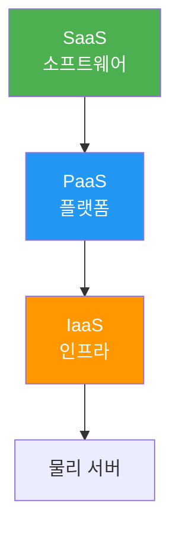

# 클라우드 컴퓨팅

> [!info] 한줄 정의
> 인터넷을 통해 컴퓨팅 자원(서버, 스토리지, 네트워크, 소프트웨어)을 온디맨드로 제공하는 서비스 모델.

## 핵심 이해

클라우드 서비스 모델은 세 가지로 구분된다. **IaaS(Infrastructure as a Service)**는 가상 서버, 스토리지 등 인프라 제공(AWS EC2, GCP Compute Engine), **PaaS(Platform as a Service)**는 런타임 환경과 미들웨어 제공(Heroku, Google App Engine), **SaaS(Software as a Service)**는 완성된 소프트웨어 제공(Gmail, Notion)이다.

주요 클라우드 제공자는 AWS, GCP, Azure가 있다. 핵심 개념으로 **스케일링(수직/수평)**, **로드 밸런싱**, **오토스케일링**, **CDN**이 있다. 서버리스(Serverless) 컴퓨팅은 서버 관리 없이 함수 단위로 코드를 실행한다(AWS Lambda, GCP Cloud Functions).

## 서비스 모델 계층

## 관련 개념

- [[Docker]] - 컨테이너 기반 클라우드 배포
- [[CI-CD]] - 클라우드 자동 배포 파이프라인
- [[HTTP]] - 클라우드 서비스 통신 프로토콜
