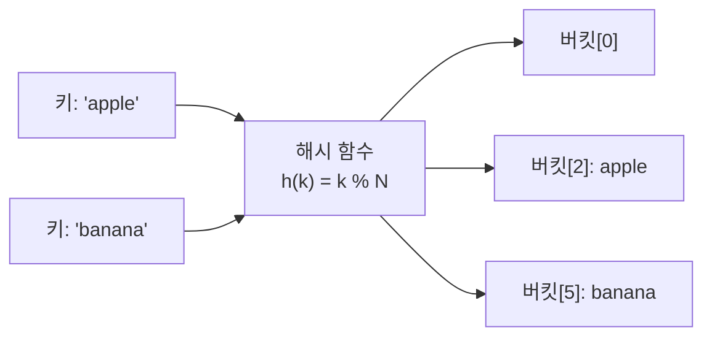

# 해시 (Hash)

> [!info] 한줄 정의
> 해시 함수로 키를 인덱스로 변환하여 O(1) 평균 탐색/삽입/삭제를 달성하는 자료구조.

## 핵심 이해

해시 테이블은 **해시 함수(Hash Function)**로 키(Key)를 배열 인덱스로 변환한다. 서로 다른 키가 같은 인덱스를 가리키는 **해시 충돌(Collision)**이 발생할 수 있으며, 개방 주소법(Open Addressing)과 체이닝(Chaining)으로 해결한다.

Python의 `dict`와 `set`이 해시 테이블 구현이다. 평균 O(1) 탐색으로 빈도수 계산, 중복 제거, 캐싱(memoization), 룩업 테이블에 활용된다. 최악의 경우 O(n)이 될 수 있으므로 좋은 해시 함수 선택이 중요하다.

## 구조 시각화

## 관련 개념

- [[시간복잡도]] - O(1) 탐색의 의미
- [[트리]] - BST와 해시의 탐색 비교
- [[재귀]] - 메모이제이션에서 해시 활용
