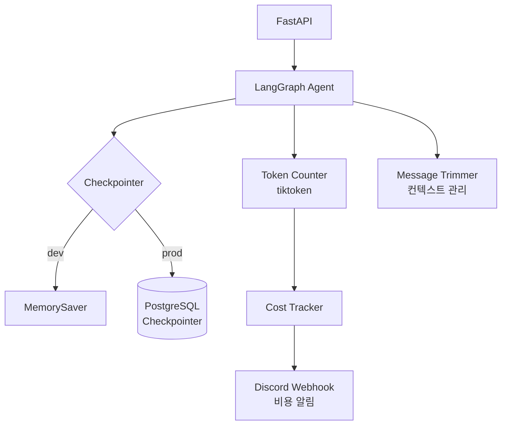

# idol-agent v0.7 - 상태관리 + 비용 추적

> [!info] 프로젝트 정보
> - **위치**: `Week09/Day02/Day7_mission/`
> - **기술 스택**: FastAPI, LangGraph, Supabase, PostgreSQL, tiktoken
> - **주차**: Week 09

## 아키텍처

## v0.6 대비 추가 사항

### 1. 체크포인터 (상태 영속화)
- **MemorySaver**: 개발 환경용 인메모리 체크포인터
- **PostgreSQL Checkpointer**: 프로덕션 Supabase 연결
- 환경변수로 전환: `CHECKPOINTER_TYPE`

### 2. 토큰 카운터
- tiktoken으로 정확한 토큰 수 계산
- 비용 산정 기초 데이터 제공

### 3. 비용 추적 + Discord 알림
- daily_cost_limit, max_context_tokens 설정
- Discord Webhook으로 비용 초과 알림

### 4. 메시지 트리밍
- 컨텍스트 윈도우 초과 방지
- 오래된 메시지 자동 제거

## 사용된 개념
- [[상태관리]] - LangGraph 체크포인터
- [[LangGraph]] - 상태 그래프 영속화
- [[Supabase]] - PostgreSQL 체크포인터 백엔드
- [[Observability]] - 비용 추적, 모니터링

## 회고
- 에이전트의 대화 상태를 영속화하여 세션 간 기억 유지
- 프로덕션 환경에서의 비용 관리 중요성 체감
