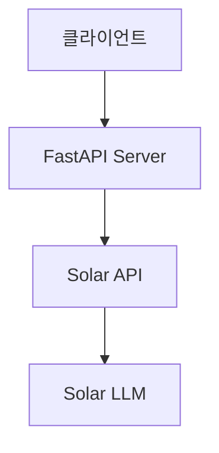

# Solar FastAPI 앱

> [!info] 프로젝트 정보
> - **위치**: `Week03/solar-project/`
> - **기술 스택**: FastAPI, Python, uv
> - **주차**: Week 03

## 아키텍처



## 프로젝트 구조

```
solar-project/
  main.py           # FastAPI 앱 진입점
  source/            # 소스 모듈
  pyproject.toml     # 의존성 관리 (uv)
```

## 핵심 구현 포인트

### 1. FastAPI 엔드포인트
- RESTful API 설계
- 비동기 요청 처리

### 2. Solar LLM 연동
- Solar API 키 기반 인증
- Solar LLM 호출 및 응답 처리

## 사용된 개념
- [[FastAPI]] - 비동기 웹 프레임워크
- [[HTTP]] - RESTful API 설계

## 회고
- FastAPI를 활용한 실전 API 서버 구축 경험
