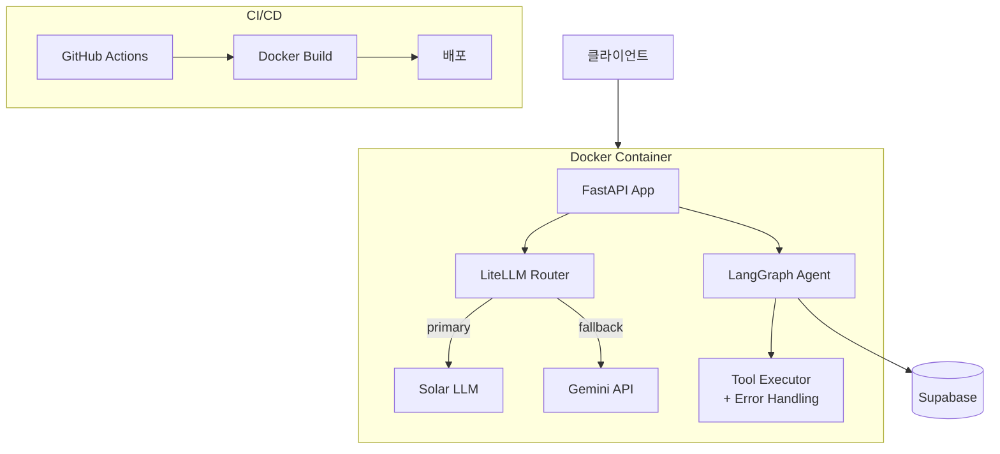

# lumi-agent v0.6 - LiteLLM + Docker + CI/CD

> [!info] 프로젝트 정보
> - **위치**: `Week09/Day01/day6-mission/`
> - **기술 스택**: FastAPI, LangGraph, LiteLLM, Docker, Supabase
> - **주차**: Week 09

## 아키텍처

## v0.2 대비 추가 사항

### 1. LiteLLM 통합
- **RetryPolicy**: 재시도 정책 설정
- **Router**: Primary(Solar) + Fallback(Gemini) 모델 라우팅
- **Config**: use_litellm, num_retries, timeout 등 환경변수

### 2. Tool 에러 핸들링
- `asyncio.wait_for`로 타임아웃 적용
- TimeoutError, 일반 에러 분기 처리

### 3. Docker 컨테이너화
- Dockerfile + docker-compose.yml
- 환경변수 기반 설정

## 사용된 개념
- [[LiteLLM]] - 멀티 프로바이더 LLM 라우팅
- [[Docker]] - 컨테이너화 및 배포
- [[CI-CD]] - GitHub Actions 자동화
- [[LangGraph]] - 에이전트 그래프
- [[FastAPI]] - API 서버

## 회고
- LLM API 장애 대응을 위한 폴백 전략 구현
- Docker를 활용한 운영 환경 패키징 학습
