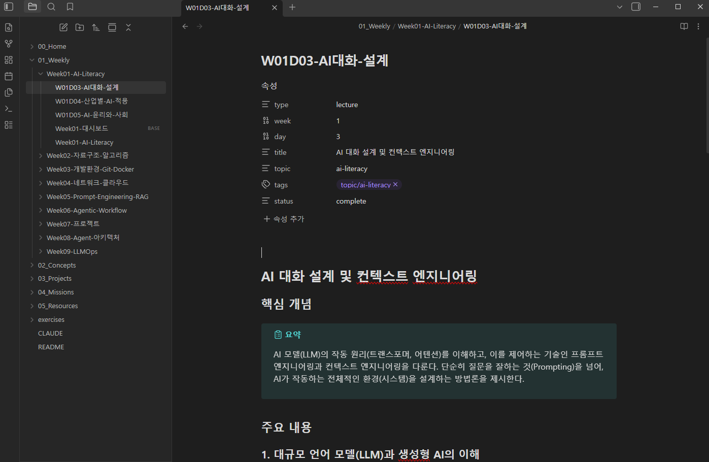
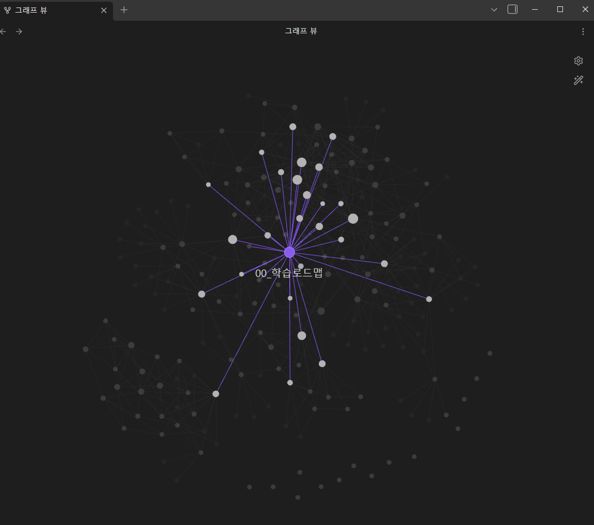

# AI Product Engineer - Interactive Learning

> AI Literacy / LLM Product Engineering 과정의 학습 노트를 **Claude Code**와 함께 인터랙티브하게 학습할 수 있는 저장소입니다.

> [!NOTE]
> **개인 학습 노트 저장소입니다.**
> 이 저장소의 모든 내용은 학습자가 직접 정리한 개인 노트이며, 특정 교육기관이나 과정의 공식 자료가 아닙니다.
> 공개된 기술 문서 및 공식 프레임워크 자료를 참고하여 작성되었습니다.



이 저장소에는 AI 교육 과정에서 정리한 **90개 이상의 학습 노트**가 체계적으로 정리되어 있습니다. Claude Code를 사용하면 AI 튜터와 대화하듯 학습할 수 있습니다.

---

## 이런 분들에게 추천합니다

- AI/LLM 분야를 체계적으로 공부하고 싶은 분
- Prompt Engineering, RAG, Agent 등 실무 AI 기술을 배우고 싶은 분
- 혼자 공부하기 막막한데 AI 튜터의 도움을 받고 싶은 분
- 코딩 초보자도 OK! (설치 가이드를 따라하면 됩니다)

---

## 시작하기 (Step by Step)

### Step 1. 이 저장소를 내 컴퓨터에 다운로드하기

터미널(명령 프롬프트)을 열고 아래 명령어를 **한 줄씩** 복사해서 붙여넣기 하세요.

```bash
git clone https://github.com/terry3838/ai-literacy-llm-engineer-learning.git
```

```bash
cd ai-literacy-llm-engineer-learning
```

> **터미널이 뭔가요?**
> - **Windows**: 시작 메뉴에서 "명령 프롬프트" 또는 "PowerShell" 검색
> - **Mac**: Spotlight(Cmd+Space)에서 "터미널" 검색
> - **git이 없다면**: [git-scm.com](https://git-scm.com) 에서 설치하세요

### Step 2. Claude Code 설치하기

Claude Code는 터미널에서 AI와 대화할 수 있는 도구입니다.

```bash
npm install -g @anthropic-ai/claude-code
```

> **npm이 없다면?**
> [nodejs.org](https://nodejs.org) 에서 Node.js를 먼저 설치하세요 (LTS 버전 추천).
> 설치 후 터미널을 다시 열고 위 명령어를 실행하면 됩니다.

### Step 3. Claude Code 실행하기

다운로드한 폴더 안에서 아래 명령어를 입력하세요.

```bash
claude
```

처음 실행하면 Anthropic 계정 로그인이 필요합니다. 화면의 안내를 따라주세요.

### Step 4. 학습 시작

Claude Code가 실행되면, 프롬프트에 아래 명령어를 입력하세요.

```
/learn
```

그러면 AI 튜터가 Week01부터 차근차근 안내해줍니다!

---

## 주요 명령어

Claude Code 프롬프트에 아래 명령어를 입력하면 됩니다.

| 명령어 | 설명 | 이럴 때 사용하세요 |
| --- | --- | --- |
| `/learn` | 주차별 순서대로 학습 | 처음 시작하거나 이어서 공부할 때 |
| `/review` | 복습 퀴즈 | 배운 내용을 점검하고 싶을 때 |
| `/explore` | 개념 탐색 | 특정 개념(RAG, LangGraph 등)을 깊이 알고 싶을 때 |
| `/mission` | 실습 도전 | 실습 과제에 도전하고 싶을 때 |
| `/roadmap` | 커리큘럼 전체 보기 | 어떤 내용이 있는지 한눈에 보고 싶을 때 |
| `/ask [질문]` | 질문하기 | 모르는 내용이 있을 때 (예: `/ask RAG가 뭐야?`) |
| `/progress` | 학습 진도 확인 | 어디까지 공부했는지 확인할 때 |

> 한국어 자연어도 지원합니다: `학습시작`, `복습`, `다음`, `이전`, `퀴즈`, `도움말` 등

---

## 커리큘럼

이 저장소에 포함된 학습 내용입니다.

### Phase 1: 기초 (Week 01~02)

| 주차 | 주제 | 핵심 내용 |
| --- | --- | --- |
| Week 01 | AI Literacy | AI 대화 설계, 산업별 AI 적용, AI 윤리 |
| Week 02 | 자료구조와 알고리즘 | 스택, 큐, 해시, 트리, 그래프, 정렬 |

### Phase 2: 개발환경 (Week 03~04)

| 주차 | 주제 | 핵심 내용 |
| --- | --- | --- |
| Week 03 | Git, Docker | 버전관리, 컨테이너, MySQL |
| Week 04 | 네트워크, 클라우드 | HTTP, 클라우드 컴퓨팅, 배포 |

### Phase 3: AI Engineering (Week 05~06)

| 주차 | 주제 | 핵심 내용 |
| --- | --- | --- |
| Week 05 | Prompt Engineering & RAG | 프롬프팅 기법, RAG 구현, 보안 |
| Week 06 | Agentic Workflow | Tool Calling, MCP, 에이전트 설계 |

### Phase 4: 실전 (Week 07~09)

| 주차 | 주제 | 핵심 내용 |
| --- | --- | --- |
| Week 07 | 프로젝트 기획 | AI 서비스 기획, 워크플로우 설계 |
| Week 08 | Agent 아키텍처 | LangGraph MVP, Streaming, CI/CD |
| Week 09 | LLMOps | LiteLLM, 상태관리, Observability |

---

## 학습 방법 안내

### 1. 순서대로 학습하기 (추천)

`/learn` 명령으로 Week01부터 차근차근 진행합니다.

- 각 Day마다 **핵심 요약** -> **상세 설명** -> **이해도 체크** 순서로 안내
- 중간에 그만둬도 다음에 이어서 할 수 있습니다 (진도 자동 저장)

### 2. 관심 있는 개념부터 탐색하기

`/explore` 명령으로 35개 개념 노트 중 궁금한 것을 선택합니다.

- RAG, LangGraph, Prompt Engineering 등 핵심 개념
- 개념 간 연결을 따라가며 깊이 학습 가능

### 3. 퀴즈로 복습하기

`/review` 명령으로 배운 내용을 점검합니다.

- 난이도 선택 가능 (쉬움 / 보통 / 어려움)
- 틀린 문제는 자동으로 "약한 영역"으로 표시

### 4. 실습에 도전하기

`/mission` 명령으로 27개 실습 과제에 도전합니다.

- 각 실습은 해당 주차 강의와 연결
- 이론과 실습을 함께 진행

---

## Obsidian에서 보기

이 저장소는 [Obsidian](https://obsidian.md) 볼트로도 사용할 수 있습니다. Obsidian으로 열면 아래처럼 **Graph View**에서 개념 간 연결 관계를 시각적으로 확인할 수 있습니다.



> Obsidian은 무료 마크다운 에디터입니다. [obsidian.md](https://obsidian.md)에서 다운로드할 수 있습니다.

---

## 폴더 구조

```text
00_Home/            로드맵, 대시보드
01_Modules/         주차별 강의 노트 (Week01~09, 일별 정리)
02_Concepts/        개념 허브 노트 (35개 핵심 개념)
03_Projects/        프로젝트 요약 (idol-agent 등)
04_Exercises/       실습 과제 (27개)
05_Resources/       논문, 참고자료
exercises/          자기주도 실습 파일
.claude/commands/   학습 시스템 명령어
```

---

## 자주 묻는 질문 (FAQ)

### Q. Claude Code가 뭔가요?

Anthropic에서 만든 터미널 기반 AI 어시스턴트입니다. 이 저장소의 학습 노트를 읽고, AI 튜터처럼 학습을 도와줍니다.

### Q. 유료인가요?

Claude Code 사용에는 Anthropic API 키 또는 Claude Pro/Max 구독이 필요합니다. 자세한 내용은 [Anthropic 공식 문서](https://docs.anthropic.com/en/docs/claude-code/overview)를 참고하세요.

### Q. 프로그래밍을 몰라도 되나요?

네! 위의 Step by Step 가이드를 따라하면 됩니다. 학습 내용 자체도 AI 기초부터 시작합니다.

### Q. Obsidian이 꼭 필요한가요?

아닙니다. Claude Code만으로 모든 학습이 가능합니다. Obsidian은 노트를 시각적으로 보고 싶을 때 선택적으로 사용하면 됩니다.

---

## 기여하기

- 오타 수정이나 내용 보완은 PR을 보내주세요
- 새로운 실습 과제는 `exercises/` 폴더에 추가해주세요
- 이슈가 있으면 [GitHub Issues](https://github.com/terry3838/ai-literacy-llm-engineer-learning/issues)에 등록해주세요

---

## Disclaimer

이 저장소는 개인 학습 과정에서 정리한 노트입니다.
공개된 기술 문서, 논문, 공식 프레임워크 문서 등을 참고하여 작성되었으며,
특정 교육 과정의 자료를 그대로 복제하지 않았습니다.
내용의 정확성을 보장하지 않으며, 학습 참고 용도로만 활용해주세요.

노트에서 다루는 기술(RAG, LangGraph, Prompt Engineering 등)의
개념과 용어는 해당 기술의 공식 문서 및 공개 자료를 기반으로 합니다.

---

**과정**: AI Product Engineer
**학습 시스템**: Claude Code Interactive Learning
**GitHub**: [terry3838/ai-literacy-llm-engineer-learning](https://github.com/terry3838/ai-literacy-llm-engineer-learning)
